# 🤖 FOODRESCUE — Agents Specification

> Dokumen ini mendefinisikan seluruh **Intelligent Agents** dalam sistem FOODRESCUE.
> Setiap agent adalah komponen otonom yang bereaksi terhadap event, mengelola state,
> dan berkomunikasi dengan agent lain untuk menjalankan business logic.

---

## Daftar Agent

| # | Agent | Layer | Domain |
|:--|:------|:------|:-------|
| 1 | [Geo-Location Agent](#1-geo-location-agent) | Frontend | Discovery |
| 2 | [Listing Feed Agent](#2-listing-feed-agent) | Frontend | Discovery |
| 3 | [Checkout & Payment Agent](#3-checkout--payment-agent) | Frontend | Transaction |
| 4 | [Countdown Undo Agent](#4-countdown-undo-agent) | Frontend + Backend | Transaction |
| 5 | [QR Voucher Agent](#5-qr-voucher-agent) | Frontend + Backend | Pickup |
| 6 | [Notification Dispatcher Agent](#6-notification-dispatcher-agent) | Backend | Communication |
| 7 | [Refund Orchestrator Agent](#7-refund-orchestrator-agent) | Backend | Finance |
| 8 | [Pickup Lifecycle Agent](#8-pickup-lifecycle-agent) | Backend | Operations |
| 9 | [AI Dynamic Pricing Agent](#9-ai-dynamic-pricing-agent) | Backend | Intelligence |
| 10 | [AI Surplus Prediction Agent](#10-ai-surplus-prediction-agent) | Backend | Intelligence |
| 11 | [AI Sentiment & Moderation Agent](#11-ai-sentiment--moderation-agent) | Backend | Intelligence |

---

## Inter-Agent Communication Map

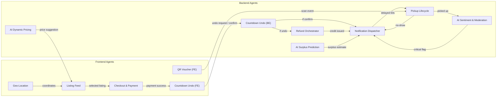

---

## 1. Geo-Location Agent

### Overview

| Aspek | Detail |
|:------|:-------|
| **Layer** | Frontend |
| **Domain** | Discovery & Navigation |
| **Tanggung Jawab** | Mengelola posisi GPS pengguna, menghitung jarak, menyediakan koordinat untuk pencarian radius |

### State Machine

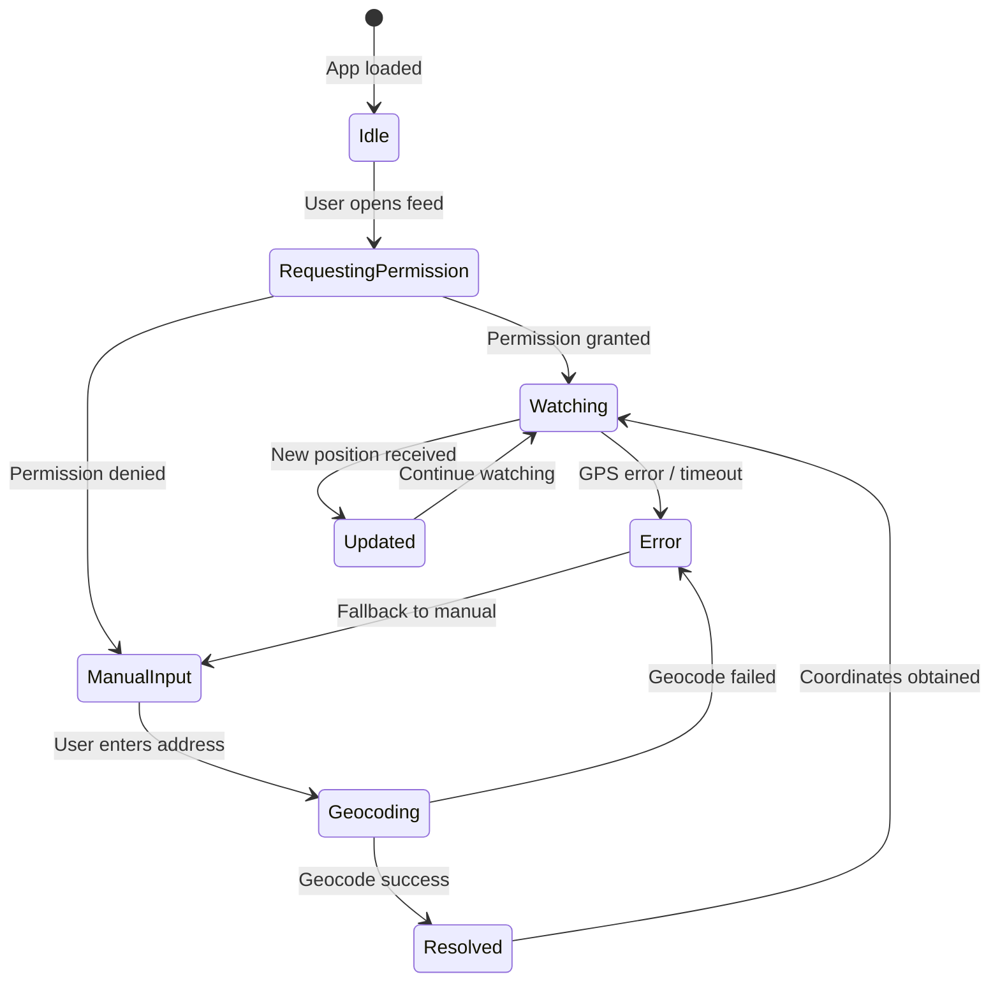

### Interface

```typescript
interface GeoLocationAgent {
  // State
  state: 'idle' | 'requesting' | 'watching' | 'manual' | 'resolved' | 'error';
  coordinates: { lat: number; lng: number } | null;
  accuracy: number | null;       // meters
  radius: number;                // search radius in km (default: 5)
  permissionStatus: PermissionState;

  // Actions
  requestPermission(): Promise<PermissionState>;
  startWatching(): void;
  stopWatching(): void;
  setManualAddress(address: string): Promise<void>;
  setRadius(km: number): void;

  // Events emitted
  onPositionUpdate: (coords: { lat: number; lng: number }) => void;
  onError: (error: GeolocationPositionError) => void;
}
```

### Behavior Rules

1. **Permission Flow**: Selalu request permission terlebih dulu. Jika denied, langsung tampilkan form manual tanpa blocking UI.
2. **Watch Mode**: Gunakan `navigator.geolocation.watchPosition` dengan `enableHighAccuracy: true`, `timeout: 10000ms`, `maximumAge: 60000ms`.
3. **Debounce**: Hanya update feed jika posisi berubah > 100 meter dari posisi sebelumnya.
4. **Fallback Chain**: GPS → IP-based geolocation → Manual address input → Default ke kota user (dari profil).
5. **Privacy**: Koordinat TIDAK disimpan ke server secara permanen. Hanya digunakan per-session untuk query.

### Implementation Hooks

```typescript
// hooks/useGeoLocation.ts
function useGeoLocation() {
  const [state, setState] = useState<GeoState>(initialState);

  // 1. Check cached permission
  // 2. Request if needed
  // 3. Start watchPosition
  // 4. Debounce position updates (100m threshold)
  // 5. Cleanup on unmount

  return { coordinates, radius, setRadius, permission, error };
}
```

---

## 2. Listing Feed Agent

### Overview

| Aspek | Detail |
|:------|:-------|
| **Layer** | Frontend |
| **Domain** | Discovery |
| **Tanggung Jawab** | Fetch, filter, sort, dan cache daftar listing surplus berdasarkan lokasi pengguna |

### State Machine

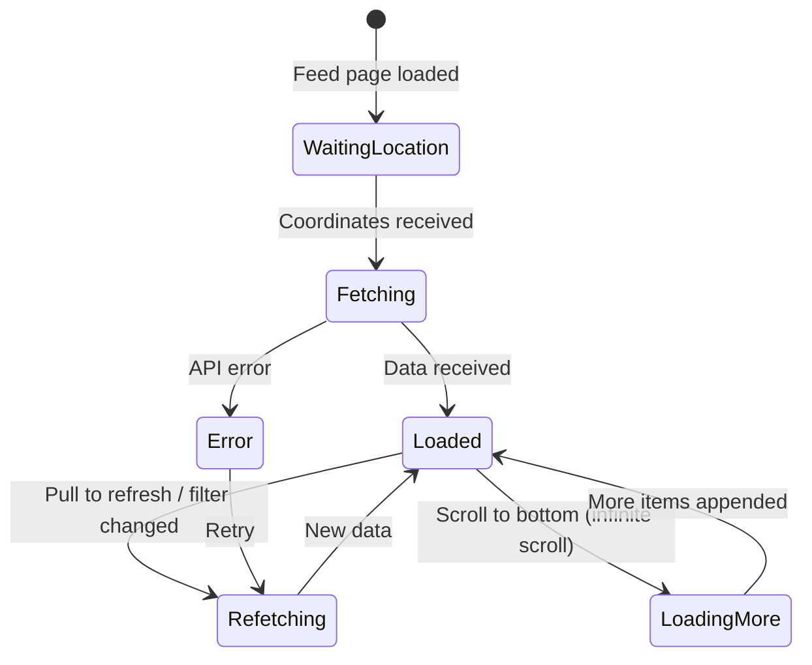

### Interface

```typescript
interface ListingFeedAgent {
  // State
  listings: Listing[];
  viewMode: 'list' | 'map';
  filters: {
    category: 'ALL' | 'REGULAR' | 'MYSTERY_BOX';
    sortBy: 'distance' | 'price' | 'pickup_deadline' | 'rating';
    maxPrice: number | null;
    allergenExclude: string[];
  };
  pagination: { page: number; hasMore: boolean };
  isLoading: boolean;
  isRefreshing: boolean;

  // Actions
  fetchListings(coords: Coords, radius: number): Promise<void>;
  loadMore(): Promise<void>;
  refresh(): Promise<void>;
  setFilter(filter: Partial<Filters>): void;
  setViewMode(mode: 'list' | 'map'): void;

  // Dependencies
  geoAgent: GeoLocationAgent;  // Receives coordinates from
}
```

### Behavior Rules

1. **Dependency**: Tidak fetch sampai `GeoLocationAgent` memberikan koordinat valid.
2. **Stale-While-Revalidate**: TanStack Query dengan `staleTime: 30s`, `gcTime: 5min`.
3. **Infinite Scroll**: Load 20 item per page, prefetch halaman berikutnya.
4. **Real-time Price**: Jika AI Dynamic Pricing mengubah harga, listing harus ter-update (polling setiap 60 detik atau WebSocket).
5. **Empty State**: Jika tidak ada listing dalam radius, tawarkan opsi memperbesar radius otomatis.
6. **Offline**: Tampilkan data ter-cache terakhir dengan badge "Data mungkin tidak terkini".

---

## 3. Checkout & Payment Agent

### Overview

| Aspek | Detail |
|:------|:-------|
| **Layer** | Frontend |
| **Domain** | Transaction |
| **Tanggung Jawab** | Mengelola alur pembelian dari cart → payment method selection → payment execution → handoff ke Countdown Undo Agent |

### State Machine

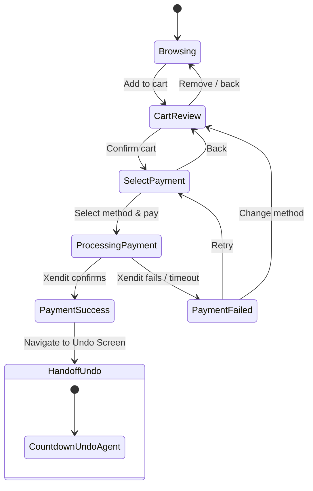

### Interface

```typescript
interface CheckoutAgent {
  // State
  cart: {
    listingId: string;
    quantity: number;
    unitPrice: number;
    totalPrice: number;
  } | null;
  paymentMethod: 'QRIS' | 'EWALLET' | 'RESCUE_CREDIT' | null;
  rescueCreditBalance: number;
  paymentState: 'idle' | 'processing' | 'success' | 'failed';
  xenditPaymentUrl: string | null;  // For e-wallet redirect

  // Actions
  addToCart(listingId: string, quantity: number): void;
  removeFromCart(): void;
  selectPaymentMethod(method: PaymentMethod): void;
  initiatePayment(): Promise<PaymentResult>;
  handlePaymentCallback(xenditPayload: object): void;

  // Validations (pre-payment)
  validateStock(): Promise<boolean>;        // Re-check stock sebelum bayar
  validatePickupWindow(): boolean;          // Listing belum expired
  validateRescueCredit(): boolean;          // Saldo cukup jika metode RC
}
```

### Behavior Rules

1. **Single Item Cart**: MVP hanya support 1 listing per checkout (simplicity). Quantity bisa > 1.
2. **Stock Re-validation**: Sebelum `initiatePayment()`, WAJIB re-check stock ke API. Jika habis, tampilkan modal "Maaf, stok sudah habis".
3. **Price Lock**: Harga yang ditampilkan saat checkout = harga saat masuk halaman detail. Jika AI mengubah harga, TIDAK berubah mid-checkout.
4. **Payment Timeout**: Jika payment processing > 5 menit (QRIS not scanned), auto-cancel dan kembalikan stock.
5. **Rescue Credit Priority**: Jika user punya saldo RC cukup, tawarkan sebagai metode pertama.
6. **Handoff**: Setelah payment success, LANGSUNG navigasi ke Undo screen. Tidak ada halaman perantara.

---

## 4. Countdown Undo Agent

### Overview

| Aspek | Detail |
|:------|:-------|
| **Layer** | Frontend + Backend (dual) |
| **Domain** | Transaction Safety |
| **Tanggung Jawab** | Menyediakan jeda 60 detik pasca-pembayaran agar consumer bisa membatalkan jika terjadi kesalahan. Backend bertindak sebagai source of truth untuk timing. |

### State Machine

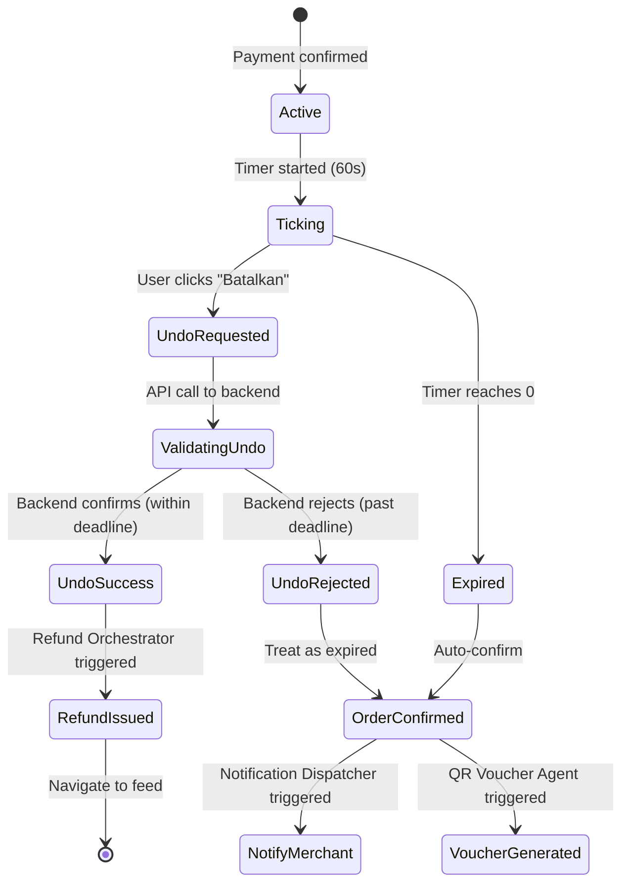

### Frontend Implementation

```typescript
interface CountdownUndoAgentFE {
  // State
  orderId: string;
  secondsRemaining: number;       // 60 → 0
  serverDeadline: Date;            // Source of truth dari backend
  state: 'active' | 'undo_requested' | 'undo_success' | 'confirmed' | 'expired';

  // Actions
  startCountdown(orderId: string, serverDeadline: Date): void;
  requestUndo(): Promise<UndoResult>;

  // Internal
  _syncWithServer(): void;         // Periodic sync setiap 10s
  _handleVisibilityChange(): void; // Tab hidden/shown
}
```

### Backend Implementation

```typescript
interface CountdownUndoAgentBE {
  // Called when payment succeeds
  initializeUndoWindow(orderId: string): {
    undoDeadline: Date;     // now() + 60s
    orderId: string;
  };

  // Called when consumer requests undo
  processUndo(orderId: string, consumerId: string): {
    success: boolean;
    reason?: 'WITHIN_WINDOW' | 'WINDOW_EXPIRED' | 'ALREADY_UNDONE';
  };

  // Called when timer expires (via BullMQ delayed job)
  confirmOrder(orderId: string): void;

  // Scheduled job: confirm orders whose undo_deadline has passed
  // Runs every 10 seconds as safety net
  cronConfirmExpiredWindows(): void;
}
```

### Behavior Rules

1. **Server is Authority**: Frontend timer adalah visual saja. Backend menyimpan `undo_deadline` dan memvalidasi setiap undo request.
2. **Idempotent Undo**: Undo request bisa dikirim berkali-kali tanpa efek ganda (double-click safe).
3. **Tab Hidden**: Jika user meninggalkan tab, saat kembali hitung ulang sisa waktu dari `serverDeadline` (bukan dari timer internal).
4. **Network Failure**: Jika undo request gagal karena network, retry otomatis hingga 3x dalam interval 2s. Tampilkan error jika tetap gagal.
5. **Non-Dismissable**: Halaman undo tidak bisa di-back, swipe, atau close secara tidak sengaja. Hanya 2 aksi: "Batalkan Pesanan" atau tunggu timer habis.
6. **Anti-Abuse**: Maksimal 3 undo per user per hari. Setelah itu, undo window tetap ada tapi tombol cancel di-disable.
7. **Confirmation Job**: BullMQ delayed job (60s delay) sebagai backup. Jika job tertunda, cron setiap 10 detik akan menangkap order yang undo window-nya sudah lewat.

---

## 5. QR Voucher Agent

### Overview

| Aspek | Detail |
|:------|:-------|
| **Layer** | Frontend (Consumer: generate) + Frontend (Merchant: scan) + Backend (verify) |
| **Domain** | Pickup Verification |
| **Tanggung Jawab** | Generate QR dinamis untuk consumer, scan & verifikasi untuk merchant, mencegah fraud |

### Flow Diagram

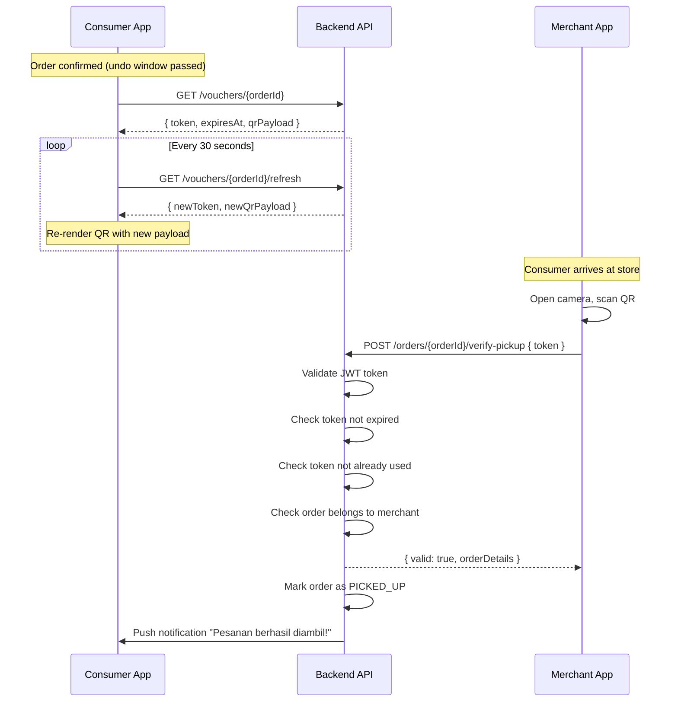

### Interface

```typescript
// === Consumer Side ===
interface QRVoucherAgentConsumer {
  orderId: string;
  currentToken: string;
  qrPayload: string;           // Encoded data for QR
  expiresAt: Date;
  refreshInterval: NodeJS.Timer;
  directionsUrl: string;        // Google Maps link

  generateQR(): void;
  startAutoRefresh(): void;     // Refresh token every 30s
  stopAutoRefresh(): void;
  openDirections(): void;       // Open Google Maps
}

// === Merchant Side ===
interface QRVoucherAgentMerchant {
  scannerState: 'idle' | 'scanning' | 'verifying' | 'success' | 'error';
  lastScanResult: VerificationResult | null;

  startScanner(): Promise<void>;  // Request camera permission
  stopScanner(): void;
  onScanDetected(rawData: string): Promise<void>;
  confirmPickup(orderId: string): Promise<void>;
}

// === Backend ===
interface QRVoucherAgentBackend {
  generateVoucherToken(orderId: string): {
    token: string;       // JWT: { orderId, consumerId, iat, exp }
    qrPayload: string;   // base64url(token)
    expiresAt: Date;      // iat + 30s
  };

  refreshToken(orderId: string): VoucherToken;

  verifyPickup(orderId: string, token: string, merchantId: string): {
    valid: boolean;
    order?: OrderSummary;
    reason?: 'INVALID_TOKEN' | 'EXPIRED' | 'ALREADY_USED' | 'WRONG_MERCHANT';
  };
}
```

### Behavior Rules

1. **Token Rotation**: QR payload berubah setiap 30 detik. Token lama langsung invalid.
2. **Anti-Screenshot**: Karena token rotate setiap 30s, screenshot QR hanya valid 30 detik.
3. **JWT Payload**: `{ sub: orderId, uid: consumerId, mid: merchantId, iat, exp: iat+30s }`, signed dengan server secret.
4. **One-Time Use**: Setelah `verifyPickup` berhasil, token di-mark `USED`. Tidak bisa di-scan ulang.
5. **Grace Period**: Token tetap bisa di-generate hingga `pickup_end + 15 menit` (grace period untuk keterlambatan minor).
6. **Offline Fallback**: Jika consumer offline saat di toko, tampilkan token terakhir yang ter-cache + order number sebagai fallback manual.
7. **Camera Permission**: Merchant scanner harus handle permission denied gracefully. Sediakan opsi input manual order number.

---

## 6. Notification Dispatcher Agent

### Overview

| Aspek | Detail |
|:------|:-------|
| **Layer** | Backend |
| **Domain** | Communication |
| **Tanggung Jawab** | Mengelola pengiriman notifikasi multi-channel dengan prioritas, delay, dan batching |

### Architecture

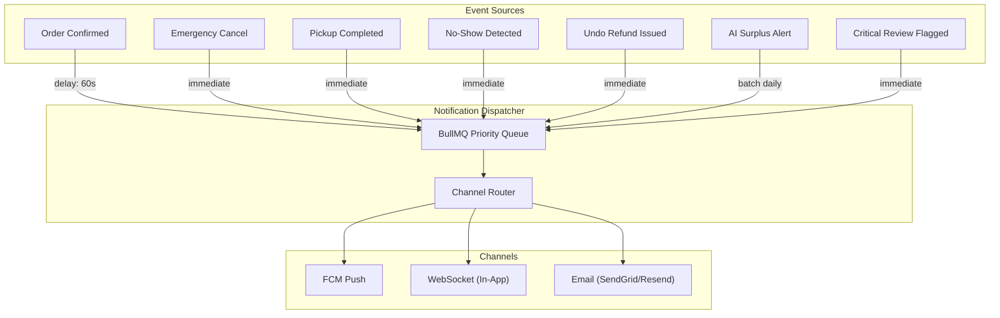

### Interface

```typescript
interface NotificationDispatcherAgent {
  // Core dispatch
  dispatch(notification: NotificationPayload): Promise<void>;

  // Delayed dispatch (for 60s undo window)
  dispatchDelayed(
    notification: NotificationPayload,
    delayMs: number
  ): Promise<string>; // returns jobId

  // Cancel delayed (if undo happens before 60s)
  cancelDelayed(jobId: string): Promise<boolean>;

  // Batch dispatch (for daily summaries)
  dispatchBatch(
    notifications: NotificationPayload[],
    scheduleAt: Date
  ): Promise<void>;
}

interface NotificationPayload {
  recipientId: string;
  title: string;
  body: string;
  channels: ('push' | 'in_app' | 'email')[];
  priority: 'urgent' | 'high' | 'normal' | 'low';
  metadata?: Record<string, any>;  // e.g. { orderId, listingId }
  actionUrl?: string;              // Deep link in PWA
}
```

### Notification Templates

| Event | Recipient | Channels | Priority | Delay |
|:------|:----------|:---------|:---------|:------|
| New order confirmed | Merchant | push, in_app | high | **60 seconds** |
| Undo cancellation | Merchant | in_app | normal | 0 |
| Refund issued (undo) | Consumer | push, in_app | high | 0 |
| Emergency cancel by merchant | Consumer | push, in_app | urgent | 0 |
| Pickup reminder (15min before) | Consumer | push | normal | scheduled |
| Pickup completed | Consumer, Merchant | in_app | normal | 0 |
| No-show detected | Consumer | push, in_app | high | 0 |
| Critical review flagged | Admin | push, email | urgent | 0 |
| Daily surplus prediction | Merchant | push, in_app | low | daily 06:00 |
| Daily sales summary | Merchant | email, in_app | low | daily 22:00 |

### Behavior Rules

1. **60-Second Delay Rule**: Notifikasi order baru ke merchant WAJIB delay 60 detik (menunggu undo window selesai). Jika consumer undo, notifikasi dibatalkan via `cancelDelayed`.
2. **Channel Fallback**: Jika push gagal (token expired), fallback ke in_app. Email hanya untuk summary dan critical alerts.
3. **Rate Limiting**: Maks 10 push per user per jam (anti-spam). Group notifikasi sejenis dalam 1 menit.
4. **Quiet Hours**: Tidak kirim push antara 22:00–07:00 kecuali priority = urgent.
5. **Idempotent**: Setiap notifikasi punya unique key. Duplicate dispatch di-ignore.

---

## 7. Refund Orchestrator Agent

### Overview

| Aspek | Detail |
|:------|:-------|
| **Layer** | Backend |
| **Domain** | Finance |
| **Tanggung Jawab** | Mengelola seluruh refund flow: undo refund, merchant emergency cancel refund, dispute refund. Memastikan konsistensi antara order status, stock, dan Rescue Credit balance. |

### State Machine

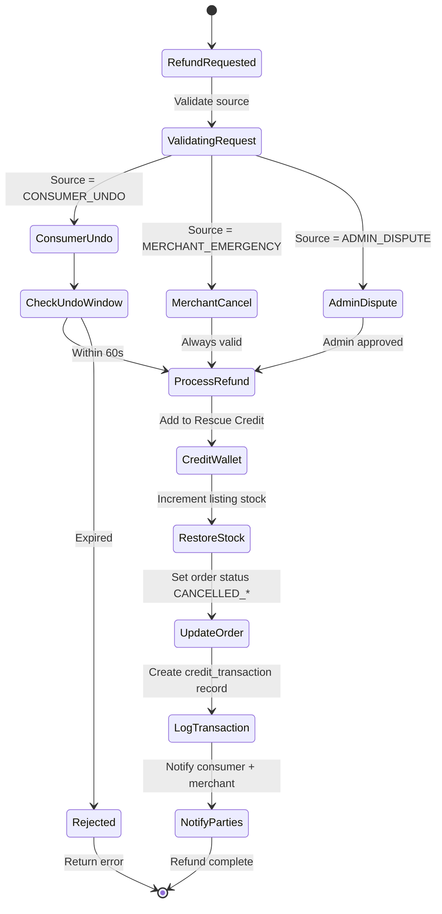

### Interface

```typescript
interface RefundOrchestratorAgent {
  processRefund(request: RefundRequest): Promise<RefundResult>;
}

interface RefundRequest {
  orderId: string;
  requestedBy: string;           // userId
  source: 'CONSUMER_UNDO' | 'MERCHANT_EMERGENCY' | 'ADMIN_DISPUTE';
  reason?: string;
  idempotencyKey: string;        // Prevent double refund
}

interface RefundResult {
  success: boolean;
  refundAmount: number;
  newCreditBalance: number;
  orderStatus: OrderStatus;
  reason?: string;               // If rejected
}
```

### Behavior Rules

1. **100% to Rescue Credit**: Semua refund masuk ke Rescue Credit, BUKAN kembali ke payment method asal. Ini menyederhanakan flow dan menghindari biaya refund dari Xendit.
2. **Idempotent**: Menggunakan `idempotencyKey` (biasanya `refund:{orderId}:{source}`). Jika key sudah ada, return hasil sebelumnya.
3. **Atomic Transaction**: Stock restoration + credit addition + order status update HARUS dalam satu database transaction. Jika salah satu gagal, rollback semua.
4. **Audit Trail**: Setiap refund tercatat di `credit_transactions` dengan referensi ke `order_id` dan `source`.
5. **Concurrent Safety**: Gunakan `SELECT FOR UPDATE` pada order row untuk mencegah race condition (double undo).
6. **Refund Amount**: Selalu 100% dari `order.total_price`. Tidak ada partial refund di MVP.

---

## 8. Pickup Lifecycle Agent

### Overview

| Aspek | Detail |
|:------|:-------|
| **Layer** | Backend |
| **Domain** | Operations |
| **Tanggung Jawab** | Mengelola lifecycle pesanan dari confirmed → preparing → ready → picked_up / no_show. Mendeteksi no-show dan trigger post-pickup actions. |

### State Machine

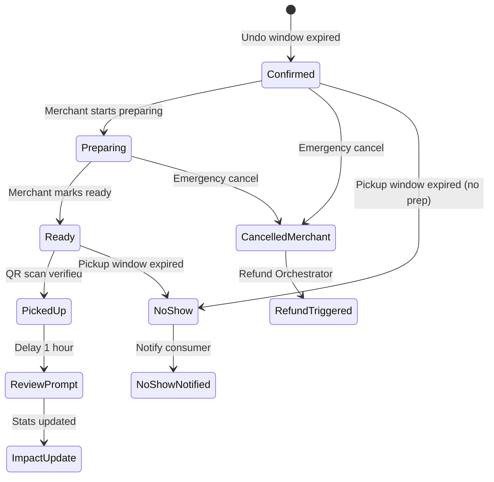

### Interface

```typescript
interface PickupLifecycleAgent {
  // Merchant actions
  markPreparing(orderId: string, merchantId: string): Promise<void>;
  markReady(orderId: string, merchantId: string): Promise<void>;
  emergencyCancel(orderId: string, merchantId: string, reason: string): Promise<void>;

  // Verification
  verifyPickup(orderId: string, voucherToken: string, merchantId: string): Promise<PickupResult>;

  // Automated checks (cron)
  detectNoShows(): Promise<NoShowResult[]>;          // Every 5 min
  expireListings(): Promise<number>;                 // Every 1 min
  sendPickupReminders(): Promise<number>;            // Every 1 min

  // Post-pickup
  scheduleReviewPrompt(orderId: string): Promise<void>;  // Delay 1 hour
  updateImpactStats(orderId: string): Promise<void>;
  checkBadgeEligibility(userId: string): Promise<Badge[]>;
}
```

### Cron Jobs

| Job | Schedule | Action |
|:----|:---------|:-------|
| `detectNoShows` | Every 5 minutes | Find orders where `status IN (CONFIRMED, PREPARING, READY)` AND `pickup_end < NOW()` → mark `NO_SHOW`, notify consumer |
| `expireListings` | Every 1 minute | Find listings where `status = ACTIVE` AND `pickup_end < NOW()` AND `quantity_remaining > 0` → mark `EXPIRED` |
| `sendPickupReminders` | Every 1 minute | Find orders where `status = CONFIRMED/READY` AND `pickup_end - NOW() BETWEEN 14min AND 16min` → send push reminder |
| `confirmExpiredUndoWindows` | Every 10 seconds | Safety net for Countdown Undo Agent |

### Behavior Rules

1. **No-Show = No Refund**: Jika consumer tidak datang hingga `pickup_end`, order hangus TANPA refund. Ini melindungi hak merchant.
2. **Grace Period**: Tidak ada grace period untuk no-show. Tepat saat `pickup_end` lewat.
3. **Post-Pickup Chain**: `verifyPickup` → update order status → update impact stats → check badge eligibility → schedule review prompt (1 jam kemudian).
4. **Merchant Status Updates**: `CONFIRMED → PREPARING → READY` adalah progression opsional. Merchant bisa langsung dari `CONFIRMED → READY` atau skip ke pickup.
5. **Emergency Cancel Window**: Merchant bisa cancel selama order belum `PICKED_UP`. Jika sudah picked_up, tidak bisa cancel.

---

## 9. AI Dynamic Pricing Agent

### Overview

| Aspek | Detail |
|:------|:-------|
| **Layer** | Backend |
| **Domain** | Intelligence — Revenue Optimization |
| **Tanggung Jawab** | Secara otomatis menyesuaikan tingkat diskon listing mendekati akhir pickup window untuk memaksimalkan rasio sold-out |

### Algorithm (MVP: Rule-Based)

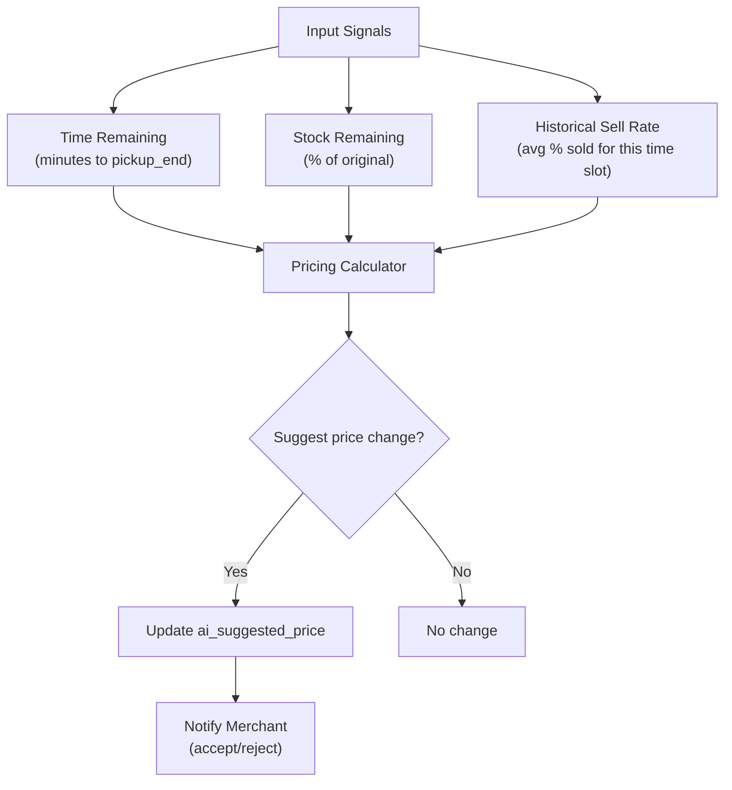

### Pricing Formula (MVP)

```typescript
function calculateSuggestedDiscount(input: PricingInput): number {
  const { timeRemainingMinutes, stockRemainingPercent, historicalSellRate } = input;

  // Base discount dari PRD: 50-70%, AI bisa push sampai 85%
  let baseDiscount = 50;

  // Time factor: semakin dekat deadline, semakin agresif
  if (timeRemainingMinutes <= 15) {
    baseDiscount += 25;       // 75%+
  } else if (timeRemainingMinutes <= 30) {
    baseDiscount += 15;       // 65%+
  } else if (timeRemainingMinutes <= 60) {
    baseDiscount += 10;       // 60%+
  }

  // Stock factor: semakin banyak sisa, semakin agresif
  if (stockRemainingPercent > 75) {
    baseDiscount += 10;
  } else if (stockRemainingPercent > 50) {
    baseDiscount += 5;
  }

  // Historical adjustment: jika biasanya sell rate rendah, lebih agresif
  if (historicalSellRate < 0.5) {
    baseDiscount += 5;
  }

  // Clamp to valid range
  return Math.min(Math.max(baseDiscount, 50), 85);
}
```

### Behavior Rules

1. **Merchant Approval**: Di MVP, AI hanya MENYARANKAN harga. Merchant harus accept/reject secara manual.
2. **Minimum Floor**: Harga setelah diskon tidak boleh di bawah "harga minimum" yang di-set merchant (biaya bahan pokok).
3. **Update Frequency**: Re-calculate setiap 15 menit ATAU ketika stock berubah (order completed / undo).
4. **No Upward Adjustment**: AI hanya boleh turunkan harga, TIDAK PERNAH naikkan harga.
5. **Notification**: Kirim notifikasi ke merchant ketika ada saran harga baru, termasuk estimasi peningkatan sell probability.

---

## 10. AI Surplus Prediction Agent

### Overview

| Aspek | Detail |
|:------|:-------|
| **Layer** | Backend |
| **Domain** | Intelligence — Demand Forecasting |
| **Tanggung Jawab** | Memprediksi volume surplus harian merchant berdasarkan data historis untuk membantu merchant merencanakan listing |

### Interface

```typescript
interface SurplusPredictionAgent {
  // Daily prediction (cron: 06:00 every day)
  generateDailyPrediction(merchantId: string): Promise<SurplusPrediction>;

  // On-demand prediction
  predictSurplus(merchantId: string, date: Date): Promise<SurplusPrediction>;
}

interface SurplusPrediction {
  merchantId: string;
  date: Date;
  estimatedPortions: number;           // Estimasi jumlah porsi surplus
  confidence: 'low' | 'medium' | 'high';
  basedOnDays: number;                  // Jumlah hari data historis
  recommendation: string;               // "Estimasi surplus hari ini: ~15 porsi"
  factors: {
    dayOfWeek: string;
    historicalAverage: number;
    trend: 'increasing' | 'stable' | 'decreasing';
  };
}
```

### Algorithm (MVP: Moving Average)

```typescript
async function predictSurplus(merchantId: string, date: Date): Promise<SurplusPrediction> {
  // 1. Get last 28 days of listing data for this merchant
  const history = await getListingHistory(merchantId, 28);

  // 2. Filter to same day of week
  const dayOfWeek = date.getDay();
  const sameDayHistory = history.filter(h => h.date.getDay() === dayOfWeek);

  // 3. Calculate weighted moving average (recent = higher weight)
  const weights = sameDayHistory.map((_, i) => i + 1); // [1, 2, 3, 4]
  const weightedAvg = weightedMovingAverage(
    sameDayHistory.map(h => h.totalQuantity),
    weights
  );

  // 4. Determine confidence
  const confidence = sameDayHistory.length >= 4 ? 'high'
                   : sameDayHistory.length >= 2 ? 'medium'
                   : 'low';

  return {
    merchantId,
    date,
    estimatedPortions: Math.round(weightedAvg),
    confidence,
    basedOnDays: sameDayHistory.length,
    // ...
  };
}
```

### Behavior Rules

1. **Minimum Data**: Butuh minimal 14 hari data historis sebelum prediksi aktif. Sebelum itu, tampilkan "Sedang belajar pola surplus Anda".
2. **Daily Trigger**: Cron job jam 06:00 setiap hari. Kirim push notification ke merchant.
3. **Day-of-Week Pattern**: Prediksi utamanya berdasarkan pola hari yang sama (Senin dibandingkan dengan Senin sebelumnya, dst).
4. **Feedback Loop**: Jika prediksi meleset > 50%, adjust model dan tandai confidence = low.

---

## 11. AI Sentiment & Moderation Agent

### Overview

| Aspek | Detail |
|:------|:-------|
| **Layer** | Backend |
| **Domain** | Intelligence — Safety & Quality |
| **Tanggung Jawab** | Analisis sentimen review, filter konten tidak pantas, deteksi keluhan keamanan pangan, dan auto-create support ticket |

### Pipeline

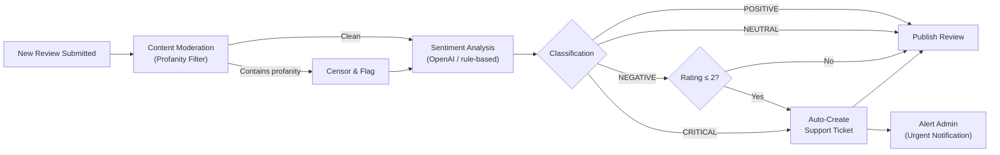

### Interface

```typescript
interface SentimentModerationAgent {
  // Main pipeline
  analyzeReview(review: ReviewInput): Promise<AnalysisResult>;

  // Sub-steps
  moderateContent(text: string): Promise<ModerationResult>;
  analyzeSentiment(text: string): Promise<SentimentResult>;
  detectFoodSafetyIssue(text: string, rating: number): Promise<boolean>;
  createAutoTicket(reviewId: string, reason: string): Promise<string>;
}

interface AnalysisResult {
  sentiment: 'POSITIVE' | 'NEUTRAL' | 'NEGATIVE' | 'CRITICAL';
  confidenceScore: number;        // 0-1
  isFlagged: boolean;
  flagReason?: string;
  moderationResult: {
    hasProfanity: boolean;
    censoredText?: string;
  };
  autoTicketId?: string;          // If support ticket was created
}
```

### Food Safety Keywords (Bahasa Indonesia + English)

```typescript
const FOOD_SAFETY_KEYWORDS = [
  // Indonesian
  'basi', 'busuk', 'expired', 'kadaluarsa', 'bau', 'mual',
  'muntah', 'diare', 'keracunan', 'sakit perut', 'tidak layak',
  'berjamur', 'jamur', 'belatung', 'lalat', 'kotor',
  'tidak higienis', 'jorok',

  // English
  'rotten', 'spoiled', 'food poisoning', 'stomach ache',
  'diarrhea', 'vomiting', 'nausea', 'moldy', 'unhygienic',
  'contaminated', 'stale',
];
```

### Behavior Rules

1. **Auto-Flag Threshold**: Rating ≤ 2 + sentiment NEGATIVE/CRITICAL → auto-flag review + create support ticket.
2. **Food Safety Priority**: Jika food safety keyword terdeteksi, SELALU create support ticket REGARDLESS of rating.
3. **Profanity Handling**: Sensor kata kasar dengan `***`, tetap publish review (kecuali > 50% konten adalah profanity → hold for manual review).
4. **Processing**: Asynchronous via BullMQ. Review visible setelah analisis selesai (biasanya < 5 detik).
5. **Fallback**: Jika OpenAI API down, fallback ke rule-based sentiment (keyword matching). Review tetap publish, tapi tandai `sentiment_source: 'fallback'`.
6. **Merchant Protection**: Jika merchant mendapat 3 critical reviews dalam 7 hari, auto-notify admin untuk investigasi + temporarily display warning badge on merchant profile.
