# 🏗️ FOODRESCUE — System Architecture

> Dokumen ini mendeskripsikan arsitektur teknis lengkap sistem FOODRESCUE mencakup
> frontend, backend, database, infrastruktur, dan integrasi layanan eksternal.

---

## 1. High-Level Architecture

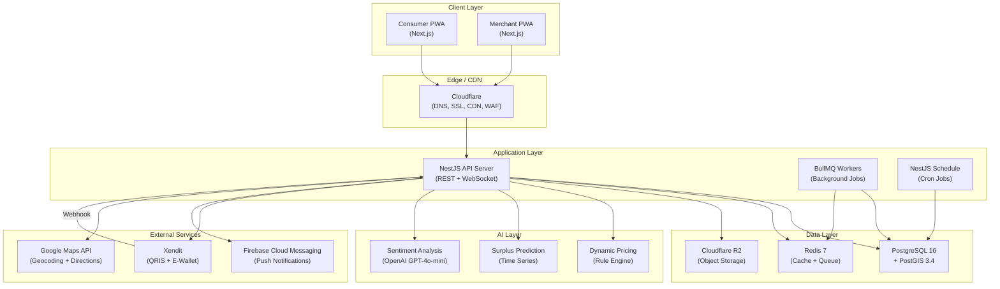

---

## 2. Frontend Architecture

### 2.1 Monorepo Structure

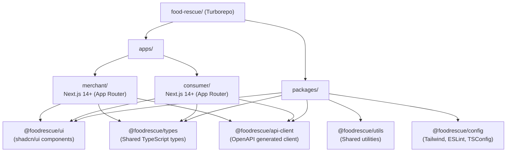

### 2.2 Consumer App — Route Map

```
app/
├── layout.tsx                  # Root layout (providers, fonts, PWA meta)
├── (auth)/
│   ├── login/page.tsx          # Email + Google OAuth login
│   ├── register/page.tsx       # Consumer registration
│   └── layout.tsx              # Auth layout (no navbar)
│
├── (main)/
│   ├── layout.tsx              # Main layout (navbar + bottom tab bar)
│   ├── feed/
│   │   └── page.tsx            # Geo-location feed (list view default)
│   ├── map/
│   │   └── page.tsx            # Map view (markers + radius)
│   ├── listing/
│   │   └── [id]/page.tsx       # Listing detail + countdown to pickup end
│   ├── checkout/
│   │   └── [listingId]/page.tsx # Cart review + payment method
│   ├── undo/
│   │   └── [orderId]/page.tsx  # 60-second countdown screen
│   ├── voucher/
│   │   └── [orderId]/page.tsx  # Digital pickup voucher + QR + directions
│   ├── wallet/
│   │   ├── page.tsx            # Rescue Credit balance
│   │   └── history/page.tsx    # Transaction history
│   ├── orders/
│   │   ├── page.tsx            # Order history list
│   │   └── [id]/page.tsx       # Order detail + status
│   ├── impact/
│   │   └── page.tsx            # Impact tracker + badges
│   └── profile/
│       ├── page.tsx            # User profile + settings
│       └── notifications/page.tsx # Notification preferences
│
├── manifest.json               # PWA manifest
└── sw.ts                       # Service Worker
```

### 2.3 Merchant App — Route Map

```
app/
├── layout.tsx
├── (auth)/
│   ├── login/page.tsx
│   ├── register/page.tsx       # Merchant registration + store setup
│   └── layout.tsx
│
├── (dashboard)/
│   ├── layout.tsx              # Dashboard layout (sidebar navigation)
│   ├── page.tsx                # Dashboard home (today's overview)
│   ├── listings/
│   │   ├── page.tsx            # Active listings list
│   │   ├── new/page.tsx        # Quick listing form
│   │   ├── [id]/edit/page.tsx  # Edit listing
│   │   └── templates/page.tsx  # Saved templates
│   ├── orders/
│   │   ├── page.tsx            # Incoming orders queue (real-time)
│   │   └── [id]/page.tsx       # Order detail + status actions
│   ├── scanner/
│   │   └── page.tsx            # QR scanner for pickup verification
│   ├── analytics/
│   │   ├── page.tsx            # Sustainability dashboard
│   │   ├── sales/page.tsx      # Sales analytics
│   │   └── impact/page.tsx     # Environmental impact metrics
│   └── settings/
│       ├── page.tsx            # Store profile settings
│       ├── payment/page.tsx    # Payment & bank account config
│       └── notifications/page.tsx
│
├── manifest.json
└── sw.ts
```

### 2.4 PWA Configuration

```typescript
// next.config.ts
import withPWA from 'next-pwa';

const config = withPWA({
  dest: 'public',
  register: true,
  skipWaiting: true,
  runtimeCaching: [
    {
      urlPattern: /^https:\/\/api\.foodrescue\.id\/listings/,
      handler: 'StaleWhileRevalidate',
      options: {
        cacheName: 'listings-cache',
        expiration: { maxEntries: 50, maxAgeSeconds: 60 },
      },
    },
    {
      urlPattern: /\.(png|jpg|jpeg|webp|svg)$/,
      handler: 'CacheFirst',
      options: {
        cacheName: 'image-cache',
        expiration: { maxEntries: 100, maxAgeSeconds: 86400 },
      },
    },
  ],
});
```

### 2.5 State Management Strategy

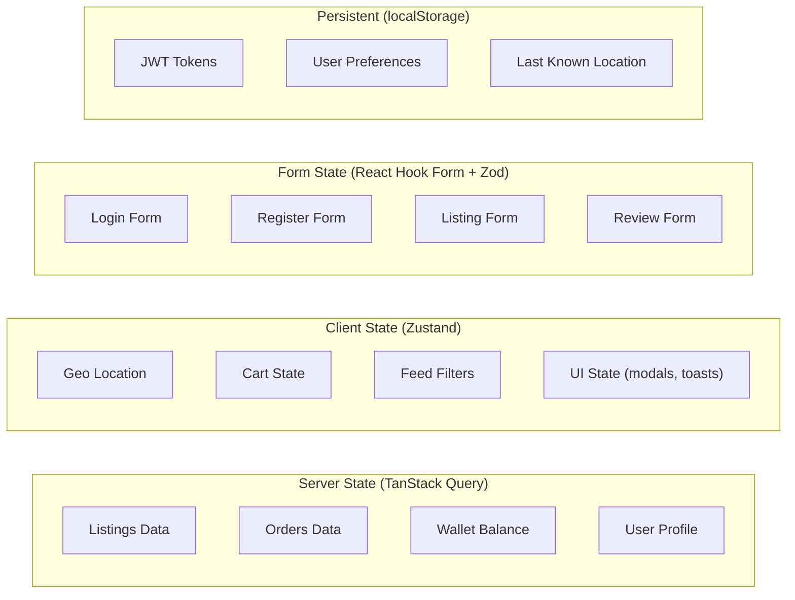

| Layer | Tool | Use Case |
|:------|:-----|:---------|
| **Server State** | TanStack Query v5 | API data fetching, caching, background refetch, optimistic updates |
| **Client State** | Zustand | Geo coordinates, cart, UI state, filters |
| **Form State** | React Hook Form + Zod | Login, register, listing creation, review submission |
| **Persistent** | localStorage (via Zustand persist middleware) | JWT, preferences, last GPS position |

---

## 3. Backend Architecture

### 3.1 NestJS Module Dependency Graph

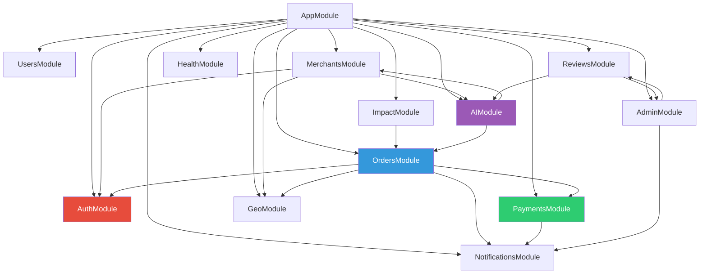

### 3.2 Request Lifecycle

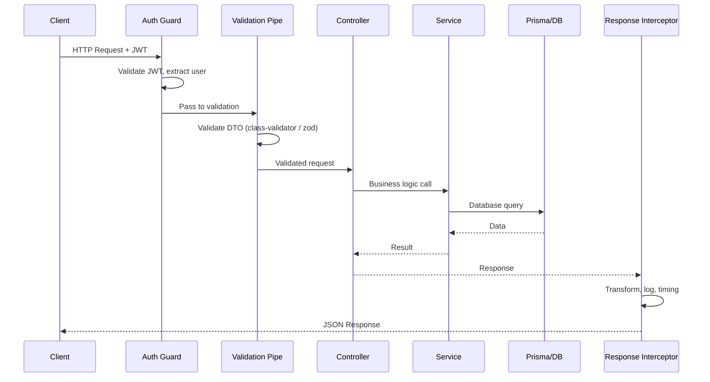

### 3.3 WebSocket Architecture

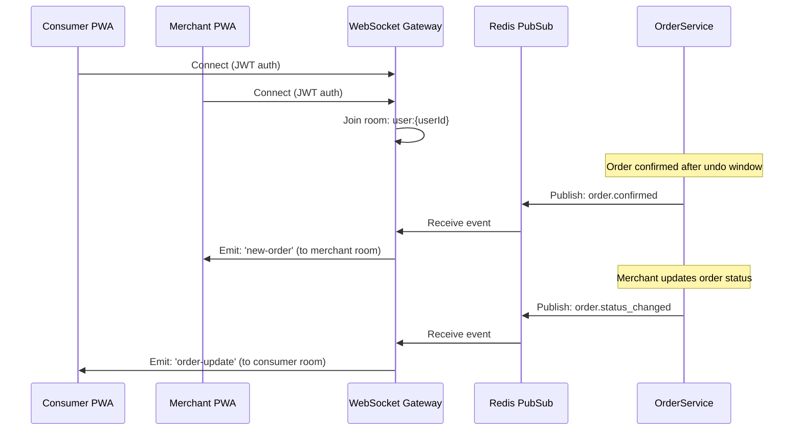

### 3.4 Background Job Architecture

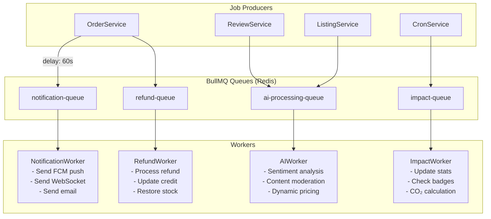

---

## 4. Database Architecture

### 4.1 Schema Overview

```mermaid
erDiagram
    USERS ||--o| MERCHANT_PROFILES : "has profile"
    USERS ||--o| RESCUE_CREDITS : "has wallet"
    USERS ||--o| IMPACT_STATS : "has stats"
    USERS ||--o{ USER_BADGES : "earned"
    USERS ||--o{ ORDERS : "placed"
    USERS ||--o{ REVIEWS : "wrote"
    USERS ||--o{ NOTIFICATIONS : "received"

    MERCHANT_PROFILES ||--o{ LISTINGS : "created"
    MERCHANT_PROFILES ||--o{ LISTING_TEMPLATES : "saved"

    LISTINGS ||--o{ ORDERS : "ordered from"

    ORDERS ||--o{ PAYMENTS : "paid via"
    ORDERS ||--o| VOUCHERS : "generated"
    ORDERS ||--o| REVIEWS : "reviewed"
    ORDERS ||--o{ SUPPORT_TICKETS : "triggered"

    RESCUE_CREDITS ||--o{ CREDIT_TRANSACTIONS : "logged"
    BADGES ||--o{ USER_BADGES : "awarded"
    REVIEWS ||--o| SUPPORT_TICKETS : "flagged"

    USERS {
        uuid id PK
        varchar email UK
        varchar password_hash
        enum role
        varchar name
        varchar phone
        varchar avatar_url
    }

    MERCHANT_PROFILES {
        uuid id PK
        uuid user_id FK
        varchar store_name
        geography location
        float avg_rating
        boolean is_verified
    }

    LISTINGS {
        uuid id PK
        uuid merchant_id FK
        varchar title
        enum category
        int original_price
        int discounted_price
        int quantity_remaining
        timestamp pickup_start
        timestamp pickup_end
        enum status
    }

    ORDERS {
        uuid id PK
        uuid consumer_id FK
        uuid listing_id FK
        uuid merchant_id FK
        int total_price
        enum status
        timestamp undo_deadline
    }

    PAYMENTS {
        uuid id PK
        uuid order_id FK
        varchar xendit_payment_id UK
        enum type
        int amount
        enum status
    }

    RESCUE_CREDITS {
        uuid id PK
        uuid user_id FK
        int balance
    }

    VOUCHERS {
        uuid id PK
        uuid order_id FK
        varchar token UK
        enum status
    }

    REVIEWS {
        uuid id PK
        uuid order_id FK
        int rating
        text comment
        enum sentiment
    }
```

### 4.2 PostGIS Geospatial Strategy

```sql
-- Tipe kolom lokasi merchant
ALTER TABLE merchant_profiles
  ADD COLUMN location geography(Point, 4326);

-- Index spasial untuk pencarian radius
CREATE INDEX idx_merchant_location
  ON merchant_profiles USING GIST (location);

-- Query: cari listing dalam radius
SELECT l.*, mp.store_name,
  ST_Distance(
    mp.location,
    ST_SetSRID(ST_MakePoint($lng, $lat), 4326)::geography
  ) AS distance_m
FROM listings l
JOIN merchant_profiles mp ON l.merchant_id = mp.id
WHERE l.status = 'ACTIVE'
  AND l.quantity_remaining > 0
  AND l.pickup_end > NOW()
  AND ST_DWithin(
    mp.location,
    ST_SetSRID(ST_MakePoint($lng, $lat), 4326)::geography,
    $radius_meters
  )
ORDER BY distance_m;
```

### 4.3 Connection & Pooling Strategy

| Environment | Strategy |
|:------------|:---------|
| **Development** | Direct connection, pool size 5 |
| **Staging** | Direct connection, pool size 10 |
| **Production** | PgBouncer (transaction mode), pool size 20 |

---

## 5. API Architecture

### 5.1 REST API Design Principles

| Principle | Implementation |
|:----------|:---------------|
| **Versioning** | URL prefix: `/api/v1/` |
| **Auth** | Bearer JWT in Authorization header |
| **Pagination** | Cursor-based (for feeds) + offset-based (for admin) |
| **Filtering** | Query params: `?category=REGULAR&sort=distance&maxPrice=30000` |
| **Error Format** | RFC 7807 Problem Details: `{ type, title, status, detail, instance }` |
| **Rate Limiting** | Headers: `X-RateLimit-Limit`, `X-RateLimit-Remaining`, `X-RateLimit-Reset` |
| **CORS** | Whitelist: `foodrescue.id`, `merchant.foodrescue.id`, `localhost:3000` (dev) |

### 5.2 Response Envelope

```typescript
// Success Response
{
  "success": true,
  "data": { ... },
  "meta": {
    "page": 1,
    "limit": 20,
    "total": 156,
    "hasMore": true,
    "cursor": "eyJpZCI6IjEyMyJ9"
  }
}

// Error Response (RFC 7807)
{
  "success": false,
  "error": {
    "type": "https://api.foodrescue.id/errors/stock-exhausted",
    "title": "Stock Exhausted",
    "status": 409,
    "detail": "The listing you're trying to order is sold out.",
    "instance": "/api/v1/orders",
    "traceId": "abc-123-def"
  }
}
```

### 5.3 Authentication Flow

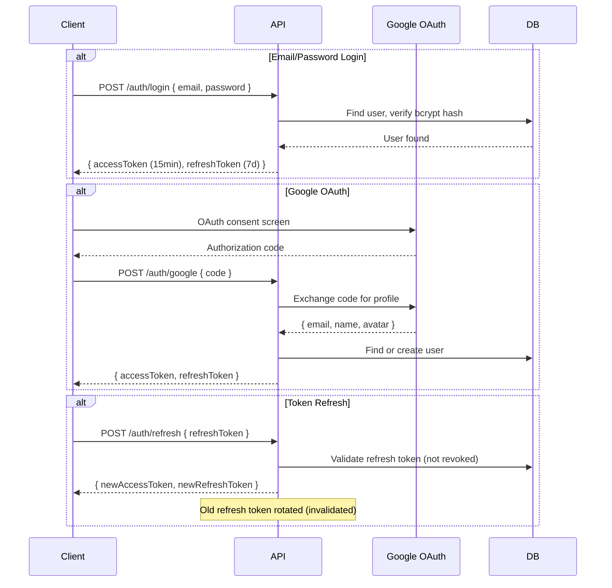

---

## 6. Integration Architecture

### 6.1 Xendit Payment Integration

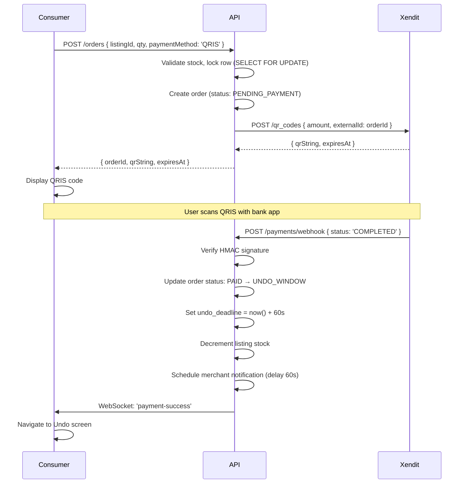

### 6.2 Firebase Cloud Messaging

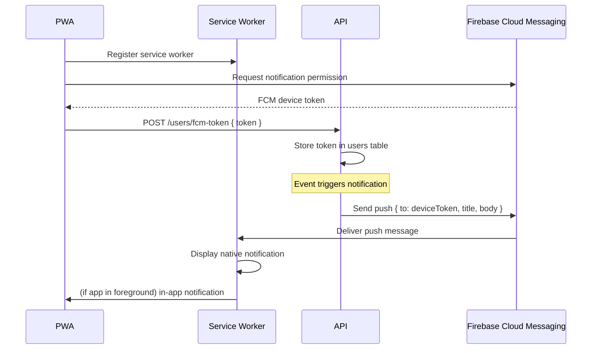

---

## 7. Security Architecture

### 7.1 Security Layers

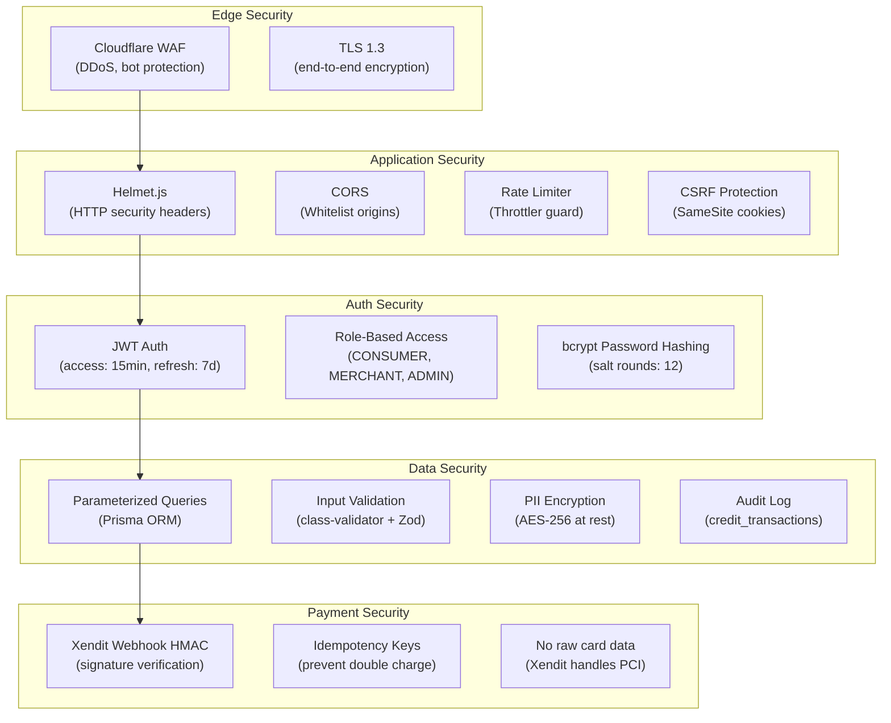

### 7.2 Role-Based Access Control (RBAC)

| Resource | CONSUMER | MERCHANT | ADMIN |
|:---------|:---------|:---------|:------|
| Browse listings | ✅ Read | ✅ Read | ✅ Read |
| Create listing | ❌ | ✅ Own | ✅ Any |
| Place order | ✅ | ❌ | ❌ |
| Undo order | ✅ Own | ❌ | ✅ Any |
| Emergency cancel | ❌ | ✅ Own | ✅ Any |
| Verify pickup (QR) | ❌ | ✅ Own | ✅ Any |
| View wallet | ✅ Own | ❌ | ✅ Any |
| Submit review | ✅ | ❌ | ❌ |
| View dashboard | ❌ | ✅ Own | ✅ Any |
| Manage tickets | ❌ | ❌ | ✅ |
| View all users | ❌ | ❌ | ✅ |

---

## 8. Performance Architecture

### 8.1 Frontend Performance Budget

| Metric | Target | Measurement |
|:-------|:-------|:------------|
| **FCP** (First Contentful Paint) | < 1.5s | Lighthouse |
| **LCP** (Largest Contentful Paint) | < 2.5s | Lighthouse |
| **FID** (First Input Delay) | < 100ms | Lighthouse |
| **CLS** (Cumulative Layout Shift) | < 0.1 | Lighthouse |
| **TTI** (Time to Interactive) | < 3.5s | Lighthouse |
| **Bundle Size** (initial JS) | < 150KB gzipped | webpack-bundle-analyzer |
| **PWA Load** (4G network) | < 2s | Real User Monitoring |

### 8.2 Backend Performance Targets

| Metric | Target |
|:-------|:-------|
| **API P50 latency** | < 100ms |
| **API P95 latency** | < 500ms |
| **API P99 latency** | < 2000ms |
| **Geo-search query** | < 200ms (PostGIS indexed) |
| **Webhook processing** | < 1000ms |
| **WebSocket message delivery** | < 100ms |

### 8.3 Caching Strategy

| Data | Cache | TTL | Invalidation |
|:-----|:------|:----|:-------------|
| Listing feed | TanStack Query (client) + Redis (server) | 30s / 60s | On stock change, price change |
| Listing detail | TanStack Query (client) | 15s | On order placed, stock change |
| User profile | TanStack Query (client) | 5min | On profile update |
| Wallet balance | TanStack Query (client) | 10s | On transaction |
| Impact stats | Redis (server) | 1hr | On order pickup |
| Merchant dashboard | Redis (server) | 5min | On order status change |
| Static assets (images) | Cloudflare CDN + SW cache | 24hr | Cache-busting via hash |
