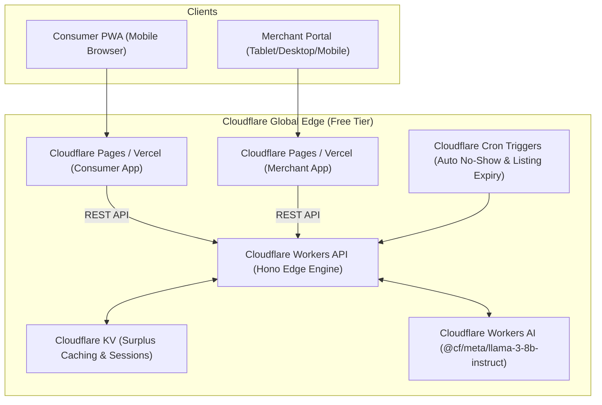

# 🚀 FOODRESCUE — Panduan Deployment Produksi (0 Rupiah)

Dokumen ini adalah panduan lengkap untuk melakukan deployment sistem **FOODRESCUE** secara gratis (*0 Rupiah*) menggunakan ekosistem **Cloudflare Workers, Cloudflare Pages, Cloudflare KV, dan Workers AI**.

---

## 🏗️ Arsitektur Infrastruktur 0 Rupiah



---

## 📋 Prasyarat (Semua Gratis)

1. Akun [Cloudflare](https://dash.cloudflare.com/) (Free Plan).
2. Akun [GitHub](https://github.com/) (untuk repositori & CI/CD Actions).
3. Node.js `v24+` dan `pnpm` terinstal di komputer lokal.

---

## ⚡ Langkah 1: Deploy Backend API (Cloudflare Workers)

### 1.1 Login ke Cloudflare Wrangler CLI
```bash
npx wrangler login
```

### 1.2 Buat KV Namespace di Cloudflare
Jalankan perintah berikut untuk membuat KV cache di edge:
```bash
# Production KV Namespace
npx wrangler kv namespace create CACHE_KV

# Preview/Development KV Namespace
npx wrangler kv namespace create CACHE_KV --preview
```
*Salin ID yang dihasilkan ke dalam file `apps/api/wrangler.jsonc` pada bagian `kv_namespaces`.*

### 1.3 Set Secrets di Cloudflare Workers
```bash
cd apps/api

# Set JWT Secret
npx wrangler secret put JWT_ACCESS_SECRET
# Masukkan secret acak yang aman (contoh: fr_jwt_prod_99x8821!)

# (Opsional) Set Kredensial Xendit & Google jika sudah ada
npx wrangler secret put XENDIT_SECRET_KEY
npx wrangler secret put GOOGLE_CLIENT_ID
```

### 1.4 Deploy Workers API ke Edge Global
```bash
cd apps/api
pnpm deploy:prod
```
*API Anda akan langsung aktif dengan URL edge global gratis, contoh: `https://foodrescue-api.<username>.workers.dev`.*

---

## 📱 Langkah 2: Deploy Frontend Consumer & Merchant

### Opsi A: Cloudflare Pages (Rekomendasi 0 Rupiah)
1. Buka [Cloudflare Dashboard](https://dash.cloudflare.com/) > **Workers & Pages** > **Create application** > **Pages** > **Connect to Git**.
2. Pilih repositori GitHub `food-rescue`.
3. **Konfigurasi Consumer App**:
   * **Project name**: `foodrescue-app`
   * **Root directory**: `apps/consumer`
   * **Build command**: `pnpm build`
   * **Output directory**: `.next`
   * **Environment Variables**:
     * `NEXT_PUBLIC_API_URL`: `https://foodrescue-api.<username>.workers.dev`
4. **Konfigurasi Merchant App**:
   * Ulangi langkah di atas dengan **Root directory**: `apps/merchant`.
   * **Environment Variables**:
     * `NEXT_PUBLIC_API_URL`: `https://foodrescue-api.<username>.workers.dev`

### Opsi B: Vercel Free Tier (1-Click Deploy)
1. Hubungkan repo ke [Vercel](https://vercel.com).
2. Set Root Directory ke `apps/consumer` (untuk pembeli) dan `apps/merchant` (untuk gerai).
3. Isi `NEXT_PUBLIC_API_URL` dengan URL Cloudflare Worker Anda.

---

## 🤖 Langkah 3: Setup GitHub Actions CI/CD (Otomatis)

Proyek ini telah dilengkapi dengan workflow CI/CD otomatis di `.github/workflows/`:
1. Masuk ke repositori GitHub > **Settings** > **Secrets and variables** > **Actions**.
2. Tambahkan Secret berikut:
   * `CLOUDFLARE_API_TOKEN`: API Token Cloudflare dengan izin *Workers & Pages*.
   * `CLOUDFLARE_ACCOUNT_ID`: Account ID dari Cloudflare Dashboard.
3. Setiap kali Anda melakukan `git push` ke branch `main`, GitHub Actions akan otomatis:
   * Menjalankan linting dan type-checking TypeScript.
   * Menjalankan 26 suite pengujian backend API.
   * Melakukan deployment otomatis ke Cloudflare Workers.

---

## 📲 Langkah 4: Verifikasi PWA & Offline Access

Aplikasi **Consumer** dan **Merchant** telah dilengkapi dengan Progressive Web App (PWA):
1. Buka URL aplikasi di Google Chrome / Safari / Edge di smartphone.
2. Banner *"Install FOODRESCUE"* akan otomatis muncul di bagian bawah layar.
3. Klik **"Install"** atau gunakan menu browser **"Add to Home screen"**.
4. Aplikasi akan terinstal di layar utama perangkat tanpa perlu App Store / Play Store dan dapat dibuka dalam mode standalone layar penuh.
