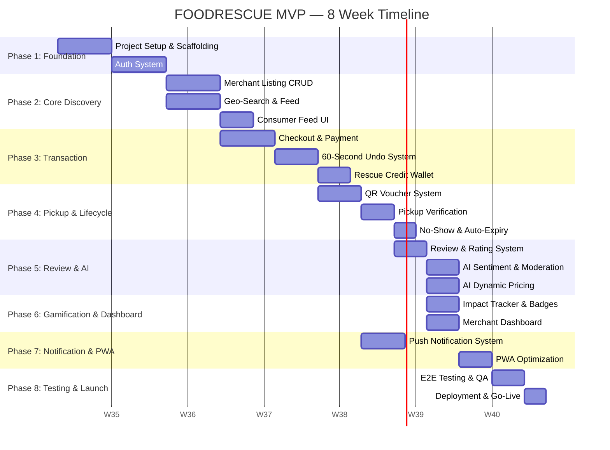
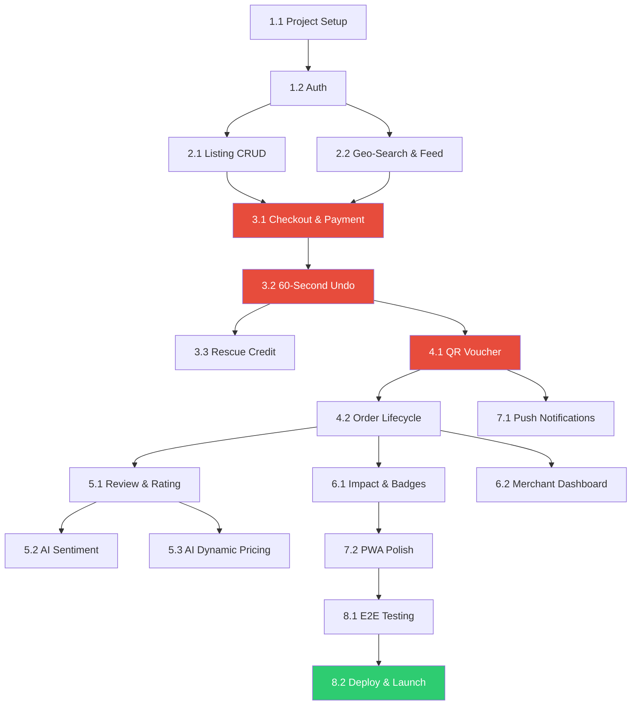

# 📋 FOODRESCUE — Implementation Plan

> Dokumen ini memecah keseluruhan pengembangan FOODRESCUE MVP menjadi **fase → flow → task → subtask**
> yang granular sehingga setiap langkah jelas terukur dan bisa di-track.
>
> **Timeline keseluruhan: 8 Minggu**
> **Referensi Rules:** Lihat [RULES.md](file:///home/mohammad-yasfiq/Documents/Development/College/food-rescue/RULES.md)
> **Referensi Agents:** Lihat [AGENTS.md](file:///home/mohammad-yasfiq/Documents/Development/College/food-rescue/AGENTS.md)
> **Referensi Architecture:** Lihat [ARCHITECTURE.md](file:///home/mohammad-yasfiq/Documents/Development/College/food-rescue/ARCHITECTURE.md)

---

## Timeline Overview

---

## Phase 1: Foundation (Minggu 1–2)

### Flow 1.1 — Project Setup & Scaffolding

> Menyiapkan seluruh fondasi proyek: monorepo, linting, database, Docker.

#### Backend Tasks

| # | Task | Subtasks | Rule Ref |
|:--|:-----|:---------|:---------|
| 1.1.1 | **Inisialisasi NestJS project** | ① `nest new backend` dengan strict TypeScript ② Konfigurasi `nest-cli.json` untuk monorepo ③ Setup path aliases (`@modules/`, `@common/`, `@config/`) | — |
| 1.1.2 | **Setup Prisma + PostgreSQL** | ① Install `prisma` + `@prisma/client` ② Buat `schema.prisma` awal (User model) ③ Konfigurasi PostGIS extension di migration ④ Setup `DATABASE_URL` via `@nestjs/config` | — |
| 1.1.3 | **Setup Redis** | ① Install `ioredis` + `@nestjs/bullmq` ② Buat `RedisModule` (global) ③ Test koneksi | — |
| 1.1.4 | **Setup Docker Compose (Dev)** | ① `docker-compose.yml`: postgres (postgis/postgis:16-3.4), redis, minio ② Health checks ③ Volume mounts ④ `.env.example` | — |
| 1.1.5 | **Setup Linting & Formatting** | ① ESLint config (NestJS preset) ② Prettier config ③ Husky + lint-staged ④ `.editorconfig` | — |
| 1.1.6 | **Setup Testing Framework** | ① Vitest/Jest config untuk unit tests ② Supertest untuk e2e ③ Test database config (separate DB) | — |
| 1.1.7 | **Common Utilities** | ① Exception filter (global) → format RFC 7807 ② Validation pipe (global) ③ Logging interceptor (request/response timing) ④ Custom decorators: `@CurrentUser()`, `@Roles()` | `PLT-007` |

#### Frontend Tasks

| # | Task | Subtasks | Rule Ref |
|:--|:-----|:---------|:---------|
| 1.1.8 | **Inisialisasi Turborepo monorepo** | ① `npx create-turbo@latest` ② Konfigurasi `pnpm-workspace.yaml` ③ Setup `turbo.json` (pipeline: build, lint, test) | — |
| 1.1.9 | **Scaffold Consumer App** | ① `npx create-next-app apps/consumer` (App Router, TypeScript, Tailwind) ② Setup folder structure sesuai [ARCHITECTURE.md](file:///home/mohammad-yasfiq/Documents/Development/College/food-rescue/ARCHITECTURE.md) ③ Root layout + metadata | — |
| 1.1.10 | **Scaffold Merchant App** | ① `npx create-next-app apps/merchant` (App Router, TypeScript, Tailwind) ② Setup folder structure ③ Root layout + sidebar layout | — |
| 1.1.11 | **Setup shared packages** | ① `@foodrescue/ui`: init + shadcn/ui install + base components (Button, Card, Input, Modal) ② `@foodrescue/types`: shared interfaces & enums ③ `@foodrescue/utils`: shared functions ④ `@foodrescue/config`: shared tailwind + tsconfig | — |
| 1.1.12 | **Setup API client** | ① Install `axios` / `ky` ② Buat base API client dengan interceptors (auth, error handling) ③ Buat typed service classes per domain ④ Setup TanStack Query provider | — |
| 1.1.13 | **PWA Initial Setup** | ① Install `next-pwa` / `@serwist/next` ② Buat `manifest.json` (name, icons, theme_color) ③ Buat basic service worker ④ Test install prompt | `PLT-001` |
| 1.1.14 | **Design Token & Theme** | ① Tailwind config: warna brand, font (Inter), spacing scale ② Dark mode support (CSS variables) ③ Buat Storybook (opsional) | — |

**✅ Checkpoint:** Docker up, database connected, both apps run locally, linting passes.

---

### Flow 1.2 — Authentication System

> Login, register, JWT, OAuth, role guards.

#### Backend Tasks

| # | Task | Subtasks | Rule Ref |
|:--|:-----|:---------|:---------|
| 1.2.1 | **User schema & migration** | ① Prisma model: `User` (id, email, password_hash, role, name, phone, avatar_url, created_at) ② Enum: `Role { CONSUMER, MERCHANT, ADMIN }` ③ Migration + seed script (admin user) | `AUTH-001`, `AUTH-006` |
| 1.2.2 | **Register endpoint** | ① `POST /auth/register` → DTO validation (email, password, name, role) ② bcrypt hash password (salt: 12) ③ Check email uniqueness ④ Return user (tanpa password_hash) | `AUTH-001`, `AUTH-002`, `AUTH-003` |
| 1.2.3 | **Login endpoint** | ① `POST /auth/login` → validate credentials ② Generate JWT access token (15min) + refresh token (7d) ③ Implement login attempt counter (Redis) ④ Lock after 5 failures (15 min cooldown) | `AUTH-004`, `AUTH-008` |
| 1.2.4 | **JWT Strategy & Guards** | ① Passport JWT strategy (extract from Bearer header) ② `JwtAuthGuard` (global optional) ③ `RolesGuard` (check `@Roles('MERCHANT')`) ④ `@Public()` decorator for open endpoints | `AUTH-004`, `AUTH-006` |
| 1.2.5 | **Refresh token flow** | ① `POST /auth/refresh` → validate refresh token ② Rotate: invalidate old, issue new pair ③ Store refresh token hash in DB | `AUTH-005` |
| 1.2.6 | **Google OAuth** | ① `POST /auth/google` → receive auth code ② Exchange code for Google profile ③ Find or create user (link if email exists) ④ Return JWT pair | `AUTH-007` |
| 1.2.7 | **Get current user** | ① `GET /auth/me` → return user profile from JWT ② Include role-specific data (merchant profile if merchant) | — |

#### Frontend Tasks

| # | Task | Subtasks | Rule Ref |
|:--|:-----|:---------|:---------|
| 1.2.8 | **Login page (Consumer)** | ① Form: email + password (React Hook Form + Zod) ② Google OAuth button ③ "Daftar akun baru" link ④ Error handling (invalid credentials, locked account) ⑤ Store JWT in localStorage | `AUTH-002` |
| 1.2.9 | **Register page (Consumer)** | ① Form: name, email, password, confirm password ② Password strength indicator ③ Terms of service checkbox ④ Auto-login after register | `AUTH-002` |
| 1.2.10 | **Login page (Merchant)** | ① Same form as consumer ② After login, check if merchant profile complete → redirect to setup if not | `AUTH-009` |
| 1.2.11 | **Register page (Merchant)** | ① Step 1: Account info (name, email, password) ② Step 2: Store info (store name, address, category) ③ Step 3: Location pin (map picker) ④ Step 4: Photo upload (store logo) | `AUTH-009` |
| 1.2.12 | **Auth middleware (Next.js)** | ① Middleware to protect routes ② Redirect unauthenticated to `/login` ③ Redirect wrong role (consumer to consumer app, merchant to merchant app) ④ Token refresh on 401 | `AUTH-004` |
| 1.2.13 | **Auth state management** | ① Zustand auth store (user, tokens, isAuthenticated) ② Persist to localStorage ③ Auto-logout on token expiry ④ Token refresh interceptor in API client | `AUTH-004`, `AUTH-005` |

**✅ Checkpoint:** User can register, login (email + Google), tokens managed, routes protected.

---

## Phase 2: Core Discovery (Minggu 3–4)

### Flow 2.1 — Merchant Listing CRUD

> Merchant membuat, mengedit, dan mengelola listing surplus makanan.

#### Backend Tasks

| # | Task | Subtasks | Rule Ref |
|:--|:-----|:---------|:---------|
| 2.1.1 | **Listing schema & migration** | ① Prisma model: `Listing` (semua field sesuai ERD) ② Enum: `ListingCategory { REGULAR, MYSTERY_BOX }` ③ Enum: `ListingStatus { ACTIVE, SOLD_OUT, EXPIRED, CANCELLED }` ④ Indexes: status + pickup_end composite | `LST-012` |
| 2.1.2 | **Create listing endpoint** | ① `POST /merchants/listings` → DTO validation ② Validate: discount 50-85%, pickup window 30min-8hr, qty 1-100 ③ Validate: pickup_start >= now() ④ Validate: photo required ⑤ Calculate discounted_price from original + discount % ⑥ Set status = ACTIVE | `LST-001` — `LST-007` |
| 2.1.3 | **Photo upload** | ① `POST /upload/image` → presigned URL to S3/R2 ② Validate file type (jpg, png, webp) + size (≤ 5MB) ③ Return public URL ④ Image optimization (sharp: resize, webp convert) | `LST-007` |
| 2.1.4 | **Update listing endpoint** | ① `PATCH /merchants/listings/:id` → partial update ② Ownership check (merchant_id = current user) ③ Cannot edit if status != ACTIVE ④ Re-validate discount rules | `LST-010`, `LST-011` |
| 2.1.5 | **Delete listing endpoint** | ① `DELETE /merchants/listings/:id` → soft delete (status = CANCELLED) ② Ownership check ③ Cannot delete if has active orders | `LST-011` |
| 2.1.6 | **List merchant's listings** | ① `GET /merchants/listings?status=ACTIVE&page=1` ② Filter by status ③ Pagination ④ Include order count per listing | — |
| 2.1.7 | **Listing templates** | ① `POST /merchants/templates` → save template ② `GET /merchants/templates` → list templates ③ `POST /merchants/listings/from-template/:id` → create from template ④ Max 10 templates per merchant | `LST-014` |
| 2.1.8 | **Auto-expiry cron job** | ① NestJS `@Cron('*/1 * * * *')` → every 1 minute ② Find listings: status=ACTIVE AND pickup_end < NOW() ③ Bulk update status = EXPIRED ④ Log count | `LST-008` |
| 2.1.9 | **Auto sold-out trigger** | ① After order confirmed: check if quantity_remaining = 0 ② If yes: update status = SOLD_OUT ③ Integrate in order service | `LST-009` |

#### Frontend Tasks (Merchant App)

| # | Task | Subtasks | Rule Ref |
|:--|:-----|:---------|:---------|
| 2.1.10 | **Quick listing form** | ① Multi-step form: Step 1 (Title, Category, Description) → Step 2 (Prices, Quantity) → Step 3 (Pickup Window) → Step 4 (Photo, Allergens) → Preview → Submit ② Zod validation matching backend rules ③ Photo upload with preview + crop ④ Allergen multi-select chips ⑤ Pickup time picker (date + time range) | `LST-001` — `LST-007` |
| 2.1.11 | **Listing management page** | ① Table/card view of merchant's listings ② Filter tabs: Active / Sold Out / Expired / Cancelled ③ Quick actions: Edit, Cancel, Duplicate ④ Real-time stock count | — |
| 2.1.12 | **Template management** | ① Save current form as template (name input) ② Templates list page ③ "Use template" button → pre-fill form ④ Delete template | `LST-014` |
| 2.1.13 | **Listing edit page** | ① Pre-filled form with existing data ② Disabled fields if status != ACTIVE ③ Change tracking (highlight modified fields) | `LST-010` |

**✅ Checkpoint:** Merchant can create, edit, and manage listings with all validations.

---

### Flow 2.2 — Geo-Search & Consumer Feed

> Consumer melihat listing terdekat berdasarkan lokasi GPS.

#### Backend Tasks

| # | Task | Subtasks | Rule Ref |
|:--|:-----|:---------|:---------|
| 2.2.1 | **Geo-search endpoint** | ① `GET /listings?lat=&lng=&radius=&sort=&category=&maxPrice=` ② PostGIS query: `ST_DWithin` for radius filter ③ `ST_Distance` for sorting by distance ④ Filter: status=ACTIVE, pickup_end > NOW(), quantity_remaining > 0 ⑤ Cursor-based pagination (20 items/page) | — |
| 2.2.2 | **Listing detail endpoint** | ① `GET /listings/:id` ② Include: merchant info (name, rating, address, distance if lat/lng provided) ③ Include: remaining stock, time to pickup end ④ Include: allergen labels | — |
| 2.2.3 | **Merchant profile endpoint** | ① `GET /merchants/:id/profile` (public) ② Include: store info, avg rating, total reviews, active listings count | — |

#### Frontend Tasks (Consumer App)

| # | Task | Subtasks | Rule Ref |
|:--|:-----|:---------|:---------|
| 2.2.4 | **Geo-Location Agent hook** | ① `useGeoLocation()` hook implementation ② GPS permission request flow ③ Watch position with debounce (100m threshold) ④ Manual address input fallback (with geocoding) ⑤ Persist last known location (localStorage) | — |
| 2.2.5 | **Feed page — List View** | ① Listing card component (photo, title, price, original price strikethrough, distance, pickup window, stock badge) ② Infinite scroll (TanStack Query + `useInfiniteQuery`) ③ Pull-to-refresh ④ Skeleton loading state ⑤ Empty state: "Tidak ada listing terdekat" + expand radius button | — |
| 2.2.6 | **Feed page — Map View** | ① Map component (Mapbox GL / Google Maps) ② Merchant markers with listing count ③ User location marker + radius circle overlay ④ Marker click → listing card popup ⑤ Cluster markers when zoomed out | — |
| 2.2.7 | **Filter & Sort controls** | ① Category filter: All / Regular / Mystery Box ② Sort: Terdekat / Termurah / Segera Habis / Rating ③ Max price slider ④ Allergen exclude multi-select ⑤ Persist filter state (Zustand) | — |
| 2.2.8 | **Listing detail page** | ① Full-size photo (swipeable if multiple) ② Price: discounted (large) + original (strikethrough) + discount badge (e.g. "60% OFF") ③ Countdown timer to `pickup_end` ("Ambil sebelum 2 jam 30 menit") ④ Stock remaining badge ("Sisa 3 porsi") ⑤ Allergen labels (chips) ⑥ Merchant card (name, rating, address, distance) ⑦ Google Maps mini-preview + "Petunjuk Arah" button ⑧ "Pesan Sekarang" CTA button (sticky bottom) | — |
| 2.2.9 | **Quantity selector** | ① +/- stepper on detail page ② Max = quantity_remaining ③ Total price calculation (realtime) | `ORD-011` |

**✅ Checkpoint:** Consumer can browse listings by location (list + map), filter, view details.

---

## Phase 3: Transaction (Minggu 4–5)

### Flow 3.1 — Checkout & Payment

> Consumer memesan dan membayar listing.

#### Backend Tasks

| # | Task | Subtasks | Rule Ref |
|:--|:-----|:---------|:---------|
| 3.1.1 | **Order schema & migration** | ① Prisma model: `Order` (all fields from ERD) ② Enum: `OrderStatus` (10 states) ③ Prisma model: `Payment` ④ Indexes: consumer_id, merchant_id, status+undo_deadline | — |
| 3.1.2 | **Create order endpoint** | ① `POST /orders` → { listingId, quantity, paymentMethod } ② Re-validate stock: `SELECT ... FOR UPDATE` (row lock) ③ Validate: listing ACTIVE, pickup_end > NOW() ④ Snapshot price at order time (price lock) ⑤ Generate order_number: `FR-YYYYMMDD-XXXX` ⑥ Create order with status `PENDING_PAYMENT` ⑦ Do NOT decrement stock yet | `ORD-001` — `ORD-004`, `ORD-010`, `ORD-016` |
| 3.1.3 | **Xendit QRIS integration** | ① Install `xendit-node` SDK ② `createQRCode()` → { qrString, externalId: orderId, amount, expiresAt: 5min } ③ Return QR string to frontend ④ Create `Payment` record (status: PENDING) | `PAY-001`, `PAY-003` |
| 3.1.4 | **Xendit E-Wallet integration** | ① `createEWalletCharge()` → { chargeId, redirectUrl, amount } ② Return redirect URL to frontend ③ Handle different e-wallet channels (GoPay, OVO, DANA, ShopeePay) | `PAY-001` |
| 3.1.5 | **Rescue Credit payment** | ① Check balance >= total_price ② Debit Rescue Credit (atomic) ③ Create `CreditTransaction` (type: PAYMENT_OUT) ④ Directly mark payment as SUCCESS ⑤ Skip Xendit entirely | `PAY-006`, `PAY-009` |
| 3.1.6 | **Xendit webhook handler** | ① `POST /payments/webhook/xendit` ② Verify HMAC signature ③ Find order by external_id ④ If status = COMPLETED: update payment → trigger post-payment flow ⑤ If status = FAILED/EXPIRED: cancel order, no stock impact | `PAY-004`, `PAY-005` |
| 3.1.7 | **Post-payment flow** | ① Update order status: PENDING_PAYMENT → PAID → UNDO_WINDOW ② Decrement listing stock: `quantity_remaining -= quantity` ③ Set `undo_deadline = NOW() + 60s` ④ Schedule merchant notification (BullMQ, delay: 60s) ⑤ Schedule auto-confirm job (BullMQ, delay: 60s) ⑥ Auto sold-out check (`LST-009`) ⑦ Emit WebSocket event: `payment-success` to consumer | `ORD-003`, `ORD-005`, `ORD-009` |
| 3.1.8 | **Payment timeout cleanup** | ① Cron every 1 min: find orders status=PENDING_PAYMENT AND created_at < NOW() - 5min ② Cancel order (status = CANCELLED_TIMEOUT) ③ No stock impact (never decremented) | `PAY-003` |

#### Frontend Tasks (Consumer App)

| # | Task | Subtasks | Rule Ref |
|:--|:-----|:---------|:---------|
| 3.1.9 | **Checkout page** | ① Order summary card (listing, quantity, unit price, total) ② Payment method selector: QRIS / E-Wallet / Rescue Credit ③ Rescue Credit balance display + "Gunakan saldo" option ④ Terms checkbox ⑤ "Bayar Sekarang" button | — |
| 3.1.10 | **Stock re-check** | ① Before initiating payment, call API to verify stock ② If stock exhausted → show "Stok Habis" modal → redirect to feed ③ Optimistic: disable button during check | `ORD-002`, `ORD-004` |
| 3.1.11 | **QRIS payment screen** | ① Display QR code (from Xendit qrString) ② "Scan dengan aplikasi bank/e-wallet Anda" instruction ③ Countdown timer (5 min timeout) ④ Polling order status every 3s OR WebSocket listener ⑤ Cancel button (if user wants to abort) | `PAY-003` |
| 3.1.12 | **E-Wallet redirect** | ① Redirect to Xendit e-wallet URL ② Handle callback redirect (success/failure page) ③ Deep link back to app | — |
| 3.1.13 | **Payment success → Undo transition** | ① On WebSocket `payment-success` OR poll success: navigate to `/undo/{orderId}` ② Pass server `undoDeadline` to undo page ③ No intermediate "success" page — direct to undo | — |

**✅ Checkpoint:** Full payment flow works (QRIS, E-Wallet, Rescue Credit).

---

### Flow 3.2 — 60-Second Undo System

> Jeda 60 detik pasca-pembayaran untuk membatalkan jika ada kesalahan.

#### Backend Tasks

| # | Task | Subtasks | Rule Ref |
|:--|:-----|:---------|:---------|
| 3.2.1 | **Undo endpoint** | ① `POST /orders/:id/undo` ② Validate: order belongs to current user ③ Validate: order status = UNDO_WINDOW ④ Validate: NOW() < undo_deadline (server time) ⑤ Validate: user hasn't exceeded 3 undos today (Redis counter) ⑥ Call Refund Orchestrator | `ORD-006`, `ORD-007`, `ORD-008` |
| 3.2.2 | **Refund Orchestrator (undo path)** | ① Begin database transaction ② Update order status → CANCELLED_CONSUMER ③ Restore stock: listing.quantity_remaining += order.quantity ④ Add Rescue Credit: user.balance += order.total_price ⑤ Create CreditTransaction (type: REFUND_IN) ⑥ Cancel delayed merchant notification (BullMQ removeJob) ⑦ Cancel auto-confirm job ⑧ Commit transaction ⑨ Emit WebSocket event | `ORD-015`, `PAY-007`, `PAY-009` |
| 3.2.3 | **Auto-confirm logic** | ① BullMQ delayed job (60s): process order confirmation ② Job handler: check if order still UNDO_WINDOW (not undone) ③ If yes: update status → CONFIRMED ④ Generate voucher ⑤ Merchant notification (no longer delayed — send immediately) | `ORD-009` |
| 3.2.4 | **Safety net cron** | ① Every 10s: find orders status=UNDO_WINDOW AND undo_deadline < NOW() ② Confirm them (same as auto-confirm) ③ This catches any missed BullMQ jobs | `ORD-009` |
| 3.2.5 | **Get undo status endpoint** | ① `GET /orders/:id/undo-status` ② Return: { orderId, status, undoDeadline, secondsRemaining, canUndo, undoCountToday } ③ Used by frontend for timer sync | — |

#### Frontend Tasks (Consumer App)

| # | Task | Subtasks | Rule Ref |
|:--|:-----|:---------|:---------|
| 3.2.6 | **Undo countdown screen** | ① Full-screen overlay (non-dismissable, no back button) ② Large countdown timer (60 → 0) using `requestAnimationFrame` ③ Server time sync: use `undoDeadline` from backend, not local timer ④ "Batalkan Pesanan" button (prominent, red) ⑤ "Pesanan akan dikonfirmasi secara otomatis" text ⑥ Order summary shown below timer | — |
| 3.2.7 | **Tab visibility handling** | ① Listen `visibilitychange` event ② When tab becomes visible: re-sync with server (`GET /orders/:id/undo-status`) ③ Recalculate remaining time from serverDeadline ④ If expired while hidden: navigate to voucher page | — |
| 3.2.8 | **Undo action handler** | ① On click "Batalkan": show confirmation dialog "Yakin batalkan?" ② Call `POST /orders/:id/undo` ③ On success: show "Pesanan dibatalkan. Dana dikembalikan ke Rescue Credit" toast ④ Navigate to feed ⑤ On failure (expired): show "Waktu undo telah habis" → navigate to voucher | `ORD-008` |
| 3.2.9 | **Auto-confirm transition** | ① When timer reaches 0: show "Pesanan dikonfirmasi!" animation (confetti/checkmark) ② Wait 2 seconds ③ Navigate to voucher page `/voucher/{orderId}` | — |
| 3.2.10 | **Undo limit indicator** | ① Show "Sisa undo hari ini: X/3" text ② If 0 remaining: disable undo button + show tooltip "Batas undo harian tercapai" | `ORD-007` |

**✅ Checkpoint:** Undo flow works end-to-end with server-authoritative timing.

---

### Flow 3.3 — Rescue Credit Wallet

> Dompet digital internal untuk refund dan pembayaran.

#### Backend Tasks

| # | Task | Subtasks | Rule Ref |
|:--|:-----|:---------|:---------|
| 3.3.1 | **Wallet schema & migration** | ① Prisma model: `RescueCredit` (id, user_id, balance) ② Prisma model: `CreditTransaction` (id, credit_id, order_id, type, amount, balance_after, description) ③ Auto-create RescueCredit on user registration (balance: 0) ④ Add CHECK constraint: `balance >= 0` | `PAY-006` |
| 3.3.2 | **Balance endpoint** | ① `GET /wallet/balance` → { balance, lastUpdated } | — |
| 3.3.3 | **Transaction history endpoint** | ① `GET /wallet/transactions?page=&limit=` ② Include order reference ③ Sorted by created_at DESC ④ Cursor-based pagination | `PAY-009` |
| 3.3.4 | **Credit/Debit service** | ① `creditWallet(userId, amount, orderId, description)` — atomic with SELECT FOR UPDATE ② `debitWallet(userId, amount, orderId, description)` — check balance >= amount ③ Create CreditTransaction record ④ Return new balance | `PAY-006`, `PAY-009` |

#### Frontend Tasks (Consumer App)

| # | Task | Subtasks | Rule Ref |
|:--|:-----|:---------|:---------|
| 3.3.5 | **Wallet balance page** | ① Large balance display (formatted currency) ② "Riwayat Transaksi" link ③ Balance auto-refresh (TanStack Query, refetchInterval: 10s) | — |
| 3.3.6 | **Transaction history page** | ① List of transactions (type icon, description, amount +/-, date) ② Color-coded: green for credit, red for debit ③ Tap to see order detail (if linked) ④ Infinite scroll | — |

**✅ Checkpoint:** Rescue Credit wallet functional with refund in/payment out.

---

## Phase 4: Pickup & Lifecycle (Minggu 5–6)

### Flow 4.1 — QR Voucher System

> Consumer mendapat QR voucher, merchant scan untuk verifikasi pickup.

#### Backend Tasks

| # | Task | Subtasks | Rule Ref |
|:--|:-----|:---------|:---------|
| 4.1.1 | **Voucher schema & migration** | ① Prisma model: `Voucher` (id, order_id, token, status, expires_at, used_at) ② Enum: `VoucherStatus { ACTIVE, USED, EXPIRED, CANCELLED }` | — |
| 4.1.2 | **Generate voucher** | ① Called after order confirmed (undo window passed) ② Generate JWT token: `{ sub: orderId, uid: consumerId, mid: merchantId, iat, exp: iat+30s }` ③ Sign with server secret ④ Create Voucher record (status: ACTIVE) ⑤ Return { token, qrPayload: base64url(token), expiresAt } | `PKP-001`, `PKP-002` |
| 4.1.3 | **Refresh voucher token** | ① `GET /vouchers/:orderId/refresh` ② Validate: order belongs to user, order status = CONFIRMED/PREPARING/READY ③ Validate: pickup_end + 15min > NOW() (grace period) ④ Generate new JWT token (new exp) ⑤ Invalidate previous token (optional: update DB) ⑥ Return new { token, qrPayload, expiresAt } | `PKP-003`, `PKP-005` |
| 4.1.4 | **Verify pickup endpoint** | ① `POST /orders/:id/verify-pickup` → { token } ② Verify JWT signature ③ Check token not expired ④ Check voucher not already USED ⑤ Check order belongs to this merchant ⑥ Mark voucher USED (used_at = NOW()) ⑦ Mark order PICKED_UP (picked_up_at = NOW()) ⑧ Trigger post-pickup actions ⑨ Return { valid: true, orderDetails } | `PKP-004`, `PKP-006` |

#### Frontend Tasks (Consumer App)

| # | Task | Subtasks | Rule Ref |
|:--|:-----|:---------|:---------|
| 4.1.5 | **Digital Voucher page** | ① QR code display (large, centered) using `qrcode.react` ② Auto-refresh QR every 30 seconds (call refresh endpoint) ③ Subtle animation on refresh (fade transition) ④ Order summary below QR ⑤ Pickup window: "Ambil sebelum [time]" ⑥ Store address + "Buka Google Maps" button ⑦ Order number displayed (for manual fallback) ⑧ Status indicator (real-time via WebSocket) | `PKP-002`, `PKP-003` |
| 4.1.6 | **Directions integration** | ① Google Maps link: `https://maps.google.com/maps?daddr={lat},{lng}` ② "Petunjuk Arah" button opens Maps in new tab/app ③ Mini-map preview (static image or embedded map) | — |

#### Frontend Tasks (Merchant App)

| # | Task | Subtasks | Rule Ref |
|:--|:-----|:---------|:---------|
| 4.1.7 | **QR Scanner page** | ① Camera permission request + handling denied ② Scan area overlay (viewfinder UI) ③ Using `html5-qrcode` library ④ On scan detected: extract token → call verify API ⑤ Success state: green checkmark + order details + "Serahkan pesanan" confirmation ⑥ Error state: red X + reason (invalid/expired/wrong merchant) ⑦ Manual input fallback: order number text field | `PKP-009` |
| 4.1.8 | **Scan history** | ① Log of recent scans (today) ② Each entry: order number, customer name, time, status | — |

**✅ Checkpoint:** Consumer shows QR, merchant scans & verifies, pickup completed.

---

### Flow 4.2 — Order Lifecycle & Edge Cases

> Menangani no-show, emergency cancel, dan status transitions.

#### Backend Tasks

| # | Task | Subtasks | Rule Ref |
|:--|:-----|:---------|:---------|
| 4.2.1 | **Emergency cancel endpoint** | ① `POST /orders/:id/emergency-cancel` → { reason } ② Validate: merchant owns order ③ Validate: order status NOT in [PICKED_UP, CANCELLED_*, NO_SHOW] ④ Call Refund Orchestrator (source: MERCHANT_EMERGENCY) ⑤ Send URGENT notification to consumer (immediate, no delay, no quiet hours) | `ORD-013`, `ORD-014`, `NTF-006` |
| 4.2.2 | **No-show detection cron** | ① Every 5 minutes: find orders WHERE status IN (CONFIRMED, PREPARING, READY) AND pickup_end < NOW() ② Update status → NO_SHOW ③ Send notification to consumer: "Anda tidak mengambil pesanan. Pesanan hangus tanpa refund." ④ Log no-show event | `PKP-007`, `PKP-008` |
| 4.2.3 | **Merchant order queue** | ① `GET /merchants/orders?status=CONFIRMED,PREPARING,READY&date=today` ② Real-time updates via WebSocket ③ Sort by pickup_end (soonest first) ④ Include consumer name, order number, items | — |
| 4.2.4 | **Order status update** | ① `PATCH /merchants/orders/:id/status` → { status: 'PREPARING' | 'READY' } ② Validate: valid state transition ③ Notify consumer of status change | — |
| 4.2.5 | **Order history (consumer)** | ① `GET /orders?status=&page=&limit=` ② Include listing thumbnail, merchant name, total, date ③ Filter: Active / Completed / Cancelled | — |
| 4.2.6 | **Order detail (consumer)** | ① `GET /orders/:id` ② Full order info + payment info + voucher info + review info ③ Status timeline (visual) | — |

#### Frontend Tasks

| # | Task | Subtasks | Rule Ref |
|:--|:-----|:---------|:---------|
| 4.2.7 | **Merchant order queue page** | ① Real-time list of incoming orders (WebSocket) ② Order card: consumer name, items, quantity, pickup window, order number ③ Status chips: Confirmed → Preparing → Ready ④ Action buttons: "Mulai Siapkan" / "Siap Diambil" ⑤ Emergency Cancel button (with confirmation modal + reason input) | — |
| 4.2.8 | **Consumer order history** | ① Tab navigation: Aktif / Riwayat ② Order card: listing photo, title, merchant, date, status badge, total ③ Tap → order detail page ④ Active orders show live status | — |
| 4.2.9 | **Order detail page (consumer)** | ① Status timeline (stepper UI) ② If status = CONFIRMED/READY → "Lihat Voucher" button ③ If status = PICKED_UP → "Beri Rating" button ④ If status = NO_SHOW/CANCELLED → explanation text | — |

**✅ Checkpoint:** Full order lifecycle managed: confirm, prepare, ready, pickup, no-show, emergency cancel.

---

## Phase 5: Review & AI (Minggu 6–7)

### Flow 5.1 — Review & Rating

> Consumer memberikan rating dan ulasan setelah pickup.

#### Backend Tasks

| # | Task | Subtasks | Rule Ref |
|:--|:-----|:---------|:---------|
| 5.1.1 | **Review schema & migration** | ① Prisma model: `Review` (all fields from ERD) ② Prisma model: `SupportTicket` ③ Unique constraint: one review per order | `REV-003` |
| 5.1.2 | **Submit review endpoint** | ① `POST /reviews` → { orderId, rating, comment } ② Validate: order status = PICKED_UP ③ Validate: within 48-hour window ④ Validate: no existing review for this order ⑤ Create review (sentiment: null, pending analysis) ⑥ Dispatch to AI queue for sentiment analysis ⑦ Update merchant avg_rating (aggregation) | `REV-001` — `REV-004`, `REV-008` |
| 5.1.3 | **Get reviews endpoint** | ① `GET /merchants/:id/reviews?page=&sort=` ② Only show reviews where moderation passed ③ Include consumer name (first name only), rating, comment, date ④ Sort: newest first / rating | `REV-009` |
| 5.1.4 | **Merchant avg_rating update** | ① After new review: recalculate `AVG(rating)` for merchant ② Update `merchant_profiles.avg_rating` ③ Update `merchant_profiles.total_reviews` | `REV-008` |

#### Frontend Tasks

| # | Task | Subtasks | Rule Ref |
|:--|:-----|:---------|:---------|
| 5.1.5 | **Review submission flow** | ① Star rating selector (1-5, tap/click) ② Optional comment textarea (max 500 chars) ③ "Kirim Review" button ④ Success animation → navigate to order history ⑤ Show prompt 1 hour after pickup (scheduled local notification) | `REV-001`, `REV-002` |
| 5.1.6 | **Reviews on merchant profile** | ① Reviews list on listing detail page (bottom section) ② Star distribution chart ③ Individual review cards | — |

**✅ Checkpoint:** Reviews submitted, avg rating updated, visible on merchant profile.

---

### Flow 5.2 — AI Sentiment & Moderation

> Analisis otomatis review untuk deteksi masalah keamanan pangan.

#### Backend Tasks

| # | Task | Subtasks | Rule Ref |
|:--|:-----|:---------|:---------|
| 5.2.1 | **Sentiment analysis service** | ① Integration with OpenAI API (GPT-4o-mini) ② Prompt engineering: classify review as POSITIVE/NEUTRAL/NEGATIVE/CRITICAL ③ Return sentiment + confidence score ④ Fallback: keyword-based classification if API unavailable | `AI-007` |
| 5.2.2 | **Content moderation service** | ① Profanity word list (Indonesian + English) ② Regex matching + replacement with `***` ③ Calculate profanity percentage ④ If > 50%: hold for manual review | `REV-007` |
| 5.2.3 | **Food safety detection** | ① Keyword matching against `FOOD_SAFETY_KEYWORDS` list ② Combined with sentiment = NEGATIVE/CRITICAL and rating ≤ 2 ③ Auto-create SupportTicket (type: FOOD_QUALITY) ④ Send URGENT notification to admin | `REV-005`, `REV-006` |
| 5.2.4 | **Review analysis worker** | ① BullMQ worker for `ai-processing-queue` ② Pipeline: moderation → sentiment → food safety check ③ Update review record with results ④ Mark review as visible (or held for manual review) ⑤ Timeout: if processing > 30s, publish anyway with `sentiment: null` | `AI-008` |
| 5.2.5 | **Critical review threshold check** | ① After each critical review: count critical reviews for merchant in last 7 days ② If count >= 3: send admin notification for investigation ③ Optionally: add warning badge to merchant profile | `REV-010` |

**✅ Checkpoint:** Reviews auto-analyzed, dangerous content flagged, support tickets created.

---

### Flow 5.3 — AI Dynamic Pricing

> Penyesuaian harga otomatis berdasarkan waktu dan stok.

#### Backend Tasks

| # | Task | Subtasks | Rule Ref |
|:--|:-----|:---------|:---------|
| 5.3.1 | **Pricing engine service** | ① Implement rule-based pricing formula (from [AGENTS.md](file:///home/mohammad-yasfiq/Documents/Development/College/food-rescue/AGENTS.md) §9) ② Input: time remaining, stock %, historical sell rate ③ Output: suggested discount % + suggested price ④ Clamp: 50% ≤ discount ≤ 85% ⑤ Floor: don't go below merchant minimum price | `AI-001` — `AI-004` |
| 5.3.2 | **Pricing cron job** | ① Every 15 minutes: find all ACTIVE listings with upcoming pickup_end ② For each: calculate suggested price ③ Update `ai_suggested_price` in listing ④ Notify merchant if suggestion differs from current price | `AI-005` |
| 5.3.3 | **Accept/reject suggestion endpoint** | ① `POST /merchants/listings/:id/accept-ai-price` ② Update discounted_price to ai_suggested_price ③ `POST /merchants/listings/:id/reject-ai-price` ② Clear ai_suggested_price | `AI-001` |
| 5.3.4 | **Event-triggered re-pricing** | ① After order confirmed (stock decreased): re-calculate for affected listing ② After undo (stock increased): re-calculate ③ Dispatch to queue (debounced) | `AI-005` |

#### Frontend Tasks (Merchant App)

| # | Task | Subtasks | Rule Ref |
|:--|:-----|:---------|:---------|
| 5.3.5 | **AI price suggestion UI** | ① Badge on listing card: "💡 Saran harga baru" ② Slide-up panel: current price vs suggested price + reasoning ③ "Terima" / "Tolak" buttons ④ Historical suggestion accuracy display | `AI-001` |

**✅ Checkpoint:** AI suggests prices, merchant reviews and accepts/rejects.

---

## Phase 6: Gamification & Dashboard (Minggu 7)

### Flow 6.1 — Impact Tracker & Badges

#### Backend Tasks

| # | Task | Subtasks | Rule Ref |
|:--|:-----|:---------|:---------|
| 6.1.1 | **Impact stats schema** | ① Prisma model: `ImpactStats`, `Badge`, `UserBadge` ② Seed badges table with 7 badge definitions ③ Auto-create ImpactStats on user registration | — |
| 6.1.2 | **Update impact stats** | ① After `PICKED_UP`: increment `total_portions_saved` += order.quantity ② Calculate CO₂: `total_co2_prevented += quantity × 2.5` ③ Calculate money saved: `order.original_total - order.total_price` ④ Increment total_orders_completed | `GAM-001`, `GAM-002`, `GAM-003` |
| 6.1.3 | **Badge check & award** | ① After stats update: check each badge criteria against current stats ② If threshold met AND not already earned: create UserBadge ③ Send push notification + in-app celebration | `GAM-004`, `GAM-005`, `GAM-006` |
| 6.1.4 | **Impact stats endpoint** | ① `GET /impact/me` → stats + earned badges ② `GET /impact/leaderboard` → top users (optional, privacy-conscious) | — |

#### Frontend Tasks

| # | Task | Subtasks | Rule Ref |
|:--|:-----|:---------|:---------|
| 6.1.5 | **Impact tracker page** | ① Hero section: 3 animated counters (porsi, CO₂ kg, uang dihemat) ② "Setara dengan..." comparison (e.g., "Setara menyelamatkan X pohon") ③ Badge collection grid (earned = color, unearned = grayscale + progress bar) ④ Badge detail modal (tap badge → name, description, earned date or "X lagi untuk mendapatkan") ⑤ Share button (generate shareable impact card image) | `GAM-007` |
| 6.1.6 | **Badge celebration modal** | ① Triggered when new badge earned (push notification → open app → modal) ② Confetti animation ③ Badge icon + name + description ④ "Bagikan" and "Lanjut Rescue!" buttons | `GAM-008` |

**✅ Checkpoint:** Impact stats tracked, badges awarded, gamification visible.

---

### Flow 6.2 — Merchant Sustainability Dashboard

#### Backend Tasks

| # | Task | Subtasks | Rule Ref |
|:--|:-----|:---------|:---------|
| 6.2.1 | **Dashboard analytics endpoints** | ① `GET /merchants/dashboard/overview` → today's stats (orders, revenue, portions) ② `GET /merchants/dashboard/analytics?from=&to=` → date-range aggregations ③ `GET /merchants/dashboard/impact` → total waste prevented, CO₂ saved | — |
| 6.2.2 | **Analytics aggregation** | ① Materialized view or pre-computed: daily sales summary per merchant ② Refresh materialized view via cron (hourly) ③ Fields: date, total_orders, total_revenue, total_portions, total_commission | — |

#### Frontend Tasks (Merchant App)

| # | Task | Subtasks | Rule Ref |
|:--|:-----|:---------|:---------|
| 6.2.3 | **Dashboard home page** | ① Today's overview cards: Orders Today, Revenue Today, Active Listings, Portions Saved ② Quick actions: "Buat Listing Baru", "Scan QR" ③ Recent orders feed (last 5) | — |
| 6.2.4 | **Analytics page** | ① Date range picker ② Line chart: daily revenue trend ③ Bar chart: portions sold per day ④ Donut chart: listing category breakdown ⑤ Table: top performing listings | — |
| 6.2.5 | **Sustainability impact page** | ① Total portions saved (cumulative) ② Total CO₂ prevented ③ Total waste diverted (kg) ④ Monthly comparison chart ⑤ Downloadable sustainability report (PDF — future) | — |

**✅ Checkpoint:** Merchant sees sales, revenue, and environmental impact data.

---

## Phase 7: Notifications & PWA Polish (Minggu 7–8)

### Flow 7.1 — Push Notification System

#### Backend Tasks

| # | Task | Subtasks | Rule Ref |
|:--|:-----|:---------|:---------|
| 7.1.1 | **FCM integration** | ① Install `firebase-admin` SDK ② Initialize with service account ③ `sendPushNotification(token, title, body, data)` utility ④ Handle token expiry/invalid (remove from DB) | — |
| 7.1.2 | **Notification dispatch service** | ① Implement `NotificationDispatcherAgent` (from [AGENTS.md](file:///home/mohammad-yasfiq/Documents/Development/College/food-rescue/AGENTS.md)) ② Priority queue (URGENT > HIGH > NORMAL > LOW) ③ Delayed dispatch for merchant order notification (60s) ④ Cancel delayed on undo ⑤ Quiet hours enforcement (22:00-07:00) ⑥ Rate limiting (10/hr per user) ⑦ Idempotency key for dedup | `NTF-001` — `NTF-007` |
| 7.1.3 | **Notification schema & endpoints** | ① Prisma model: `Notification` ② `GET /notifications?unread=true&page=` ③ `PATCH /notifications/:id/read` ④ `PATCH /notifications/read-all` ⑤ `GET /notifications/unread-count` | — |
| 7.1.4 | **Pickup reminder job** | ① Cron every 1 min: find orders (CONFIRMED/READY) where pickup_end - NOW() ≈ 15 min ② Send push: "Jangan lupa ambil pesanan Anda di {store} dalam 15 menit!" | `NTF-005` |
| 7.1.5 | **FCM token management** | ① `POST /users/fcm-token` → store device token ② Support multiple tokens per user (multi-device) ③ Cleanup invalid tokens on send failure | — |

#### Frontend Tasks

| # | Task | Subtasks | Rule Ref |
|:--|:-----|:---------|:---------|
| 7.1.6 | **Notification permission flow** | ① Prompt after 2nd visit (non-intrusive banner) ② Explain benefit: "Dapatkan notifikasi makanan terdekat & status pesanan" ③ Request FCM permission ④ Send token to backend ⑤ Handle denied gracefully | — |
| 7.1.7 | **Service Worker push handler** | ① `self.addEventListener('push', ...)` in SW ② Display native notification with title, body, icon ③ On notification click: open relevant page (deep link from data payload) | — |
| 7.1.8 | **In-app notification center** | ① Bell icon in navbar with unread count badge ② Dropdown/page: notification list (icon, title, body, time ago, unread dot) ③ Tap → navigate to related page (order, voucher, etc.) ④ "Tandai semua dibaca" button | — |
| 7.1.9 | **Notification preferences** | ① Settings page: toggle per notification type ② Types: Order updates (locked on), Promo/Deals, Daily summary, Pickup reminders ③ Save preferences to backend | `NTF-008` |

**✅ Checkpoint:** Push notifications functional for all events, in-app notification center working.

---

### Flow 7.2 — PWA Optimization & Polish

#### Frontend Tasks

| # | Task | Subtasks | Rule Ref |
|:--|:-----|:---------|:---------|
| 7.2.1 | **Image optimization** | ① `next/image` for all listing photos ② WebP format auto-conversion ③ Responsive srcset (thumbnail, medium, full) ④ Blur placeholder (LQIP) ⑤ Lazy loading for below-fold images | `PLT-001` |
| 7.2.2 | **Bundle optimization** | ① Analyze bundle: `@next/bundle-analyzer` ② Code-split heavy libraries (map SDK, QR scanner) via `dynamic()` ③ Remove unused dependencies ④ Target: < 150KB initial JS (gzipped) | `PLT-001` |
| 7.2.3 | **Offline support** | ① Offline fallback page (custom design) ② Cache last-viewed listings for offline browse ③ Queue failed actions for retry when online (background sync) ④ Show "Offline" banner at top | — |
| 7.2.4 | **PWA install prompt** | ① Custom install banner (after 2 visits, detected via localStorage counter) ② Explain PWA benefits: "Tambahkan ke layar utama untuk akses lebih cepat" ③ Dismiss + don't show again option ④ Handle `beforeinstallprompt` event | — |
| 7.2.5 | **Performance audit** | ① Run Lighthouse CI (all pages) ② Fix any issues: FCP, LCP, CLS, TTI ③ Target scores: Performance > 90, PWA > 90, Accessibility > 90 ④ Setup Lighthouse CI in GitHub Actions (per-PR check) | `PLT-001` |
| 7.2.6 | **Accessibility audit** | ① Run axe-core on all pages ② Fix contrast issues ③ Add aria-labels to interactive elements ④ Keyboard navigation testing ⑤ Screen reader testing (NVDA/VoiceOver) | — |

**✅ Checkpoint:** PWA optimized, offline-capable, installable, accessible.

---

## Phase 8: Testing & Launch (Minggu 8)

### Flow 8.1 — End-to-End Testing

| # | Task | Subtasks | Priority |
|:--|:-----|:---------|:---------|
| 8.1.1 | **Backend unit tests** | ① Auth service tests (register, login, token rotation) ② Order service tests (create, undo, confirm, cancel) ③ Payment service tests (Xendit mock, refund) ④ Geo service tests (PostGIS queries) ⑤ AI service tests (pricing formula, sentiment mock) ⑥ Target: >80% coverage on service layer | 🔴 Critical |
| 8.1.2 | **Backend integration tests** | ① Full order flow: create → pay → undo → refund ② Full order flow: create → pay → confirm → pickup ③ Listing lifecycle: create → expire → sold-out ④ Review pipeline: submit → moderate → flag ⑤ Use Testcontainers for real Postgres + Redis | 🔴 Critical |
| 8.1.3 | **Frontend unit tests** | ① Countdown timer hook tests ② Geo-location hook tests ③ Cart state management tests ④ Form validation tests ⑤ Price formatting utility tests | 🟡 High |
| 8.1.4 | **E2E tests (Playwright)** | ① Consumer: register → browse → checkout → undo → feed ② Consumer: browse → checkout → confirm → voucher → review ③ Merchant: login → create listing → receive order → scan QR ④ Merchant: emergency cancel → consumer gets refund ⑤ No-show scenario: order expires without pickup | 🔴 Critical |
| 8.1.5 | **Load testing** | ① Geo-search endpoint: 100 concurrent requests ② Order creation: 50 concurrent (stock race condition test) ③ Webhook handler: 200 requests burst ④ Target: P95 < 500ms for all endpoints ⑤ Tool: k6 or Artillery | 🟡 High |
| 8.1.6 | **Security testing** | ① OWASP Top 10 checklist review ② SQL injection attempt tests ③ IDOR tests (accessing other user's orders) ④ Rate limiting verification ⑤ JWT manipulation tests ⑥ Dependency audit: `npm audit` / `pnpm audit` | 🟡 High |

**✅ Checkpoint:** All critical paths tested, no P0/P1 bugs.

---

### Flow 8.2 — Deployment & Go-Live

| # | Task | Subtasks | Priority |
|:--|:-----|:---------|:---------|
| 8.2.1 | **Staging deployment** | ① Deploy backend to Railway (staging env) ② Deploy frontend to Vercel (preview) ③ Setup staging database (Railway PostgreSQL + PostGIS) ④ Setup staging Redis (Upstash) ⑤ Configure all env vars ⑥ Run migrations on staging DB ⑦ Seed staging data (test merchants, listings) | 🔴 Critical |
| 8.2.2 | **Staging smoke test** | ① Walk through full consumer flow manually ② Walk through full merchant flow manually ③ Test Xendit sandbox payments ④ Test push notifications ⑤ Test geo-search with real coordinates ⑥ Verify all cron jobs running | 🔴 Critical |
| 8.2.3 | **Production deployment** | ① Create production Railway instance ② Configure production env vars (Xendit LIVE keys, etc.) ③ Run production migrations ④ Domain setup: `foodrescue.id` → Vercel, `api.foodrescue.id` → Railway ⑤ SSL verification (Cloudflare) ⑥ CORS config for production domains | 🔴 Critical |
| 8.2.4 | **Monitoring setup** | ① Sentry: error tracking (backend + frontend) ② UptimeRobot: health check ping every 1 min ③ Vercel Analytics: Core Web Vitals ④ Set up alert channels (email / Telegram / Discord) ⑤ Create runbook for common incidents | 🟡 High |
| 8.2.5 | **Production smoke test** | ① Test payment with real (small) amount ② Test push notification delivery ③ Test QR scan flow ④ Verify SSL, CORS, rate limiting ⑤ Check all cron jobs ⑥ Verify backup is running | 🔴 Critical |
| 8.2.6 | **Go-Live checklist** | ① ✅ All critical E2E tests pass ② ✅ Xendit live keys configured ③ ✅ FCM production project configured ④ ✅ Database backup verified ⑤ ✅ Monitoring alerts configured ⑥ ✅ Error tracking active ⑦ ✅ Rate limiting active ⑧ ✅ HTTPS enforced ⑨ ✅ DNS propagated ⑩ ✅ Runbook documented | 🔴 Critical |

**🚀 LAUNCH!**

---

## Summary Statistics

| Metric | Count |
|:-------|:------|
| **Total Phases** | 8 |
| **Total Flows** | 16 |
| **Total Tasks** | ~95 |
| **Total Subtasks** | ~400+ |
| **Backend Tasks** | ~50 |
| **Frontend Tasks** | ~35 |
| **Testing Tasks** | ~6 |
| **Deployment Tasks** | ~6 |
| **Rules Referenced** | 50+ |
| **Agents Referenced** | 11 |

---

## Dependency Graph (Critical Path)

> [!IMPORTANT]
> **Critical Path**: Setup → Auth → Listing → Payment → Undo → QR Voucher → Order Lifecycle → Testing → Launch.
> Delay di salah satu node ini akan menggeser seluruh timeline. Prioritaskan resources di sini.
