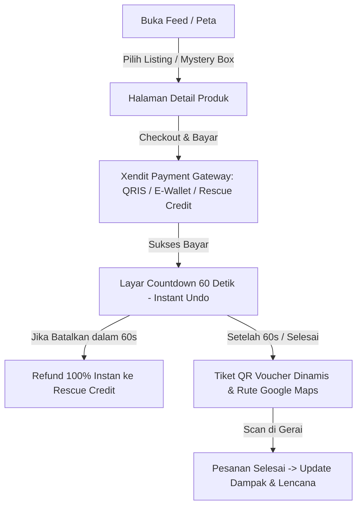

# 📋 Product Requirement Document (PRD) — FOODRESCUE v1.0.1

> **Versi Dokumen:** v1.0.1  
> **Terakhir Diperbarui:** 29 Agustus 2026  
> **Status:** Synchronized with Sliced UI & Architecture  
> **Penulis:** Product & Engineering Team FOODRESCUE

---

## 1. Ringkasan Eksekutif & Visi Produk

* **Nama Produk:** FOODRESCUE
* **Tagline:** *Save Food. Save Money.*
* **Visi Produk:** Menjadi platform *hyperlocal* terdepan yang menghubungkan bisnis F&B pemilik surplus makanan dengan konsumen urban/kampus untuk menekan angka *food waste*, mendukung ketahanan pangan, dan menyediakan makanan berkualitas siap santap dengan harga 50–70% lebih terjangkau.
* **Format Platform:** 
  * **Consumer Application:** Mobile-first Progressive Web App (PWA).
  * **Merchant Partner Portal:** Mobile-first Canvas Web App (dioptimalkan untuk operasional kasir & staf gerai).

---

## 2. Target Persona & Matriks Solusi

| Segmen Pengguna | Masalah Utama | Solusi & Nilai Tambah (Value Proposition) |
| :--- | :--- | :--- |
| **Mitra Merchant** *(Bakery, Kafe, Restoran, Warung, Katering)* | Makanan surplus layak makan terbuang di akhir hari; menimbulkan kerugian bahan baku, biaya operasional pembuangan, dan jejak karbon limbah. | <ul><li>Monetisasi sisa stok harian dengan model bagi hasil 85/15.</li><li>Otomatisasi diskon berbasis waktu (*AI Dynamic Pricing*).</li><li>Pencairan dana penjualan instan ke rekening bank terdaftar.</li><li>Kontrol operasional fleksibel dengan fitur *Tutup Gerai Instan*.</li></ul> |
| **Konsumen** *(Mahasiswa, Pekerja Urban, Gen Z)* | Anggaran makan harian terbatas; menginginkan makanan lezat, berkualitas, dan higienis di sekitar area tempat tinggal/kampus. | <ul><li>Akses makanan diskon 50–70% via *self-pickup*.</li><li>Jaminan keamanan transaksi dengan *60-Second Instant Undo*.</li><li>Pengalaman gamifikasi *Mystery Box* dan pelacakan dampak lingkungan (*Food Hero Badges*).</li><li>Kemudahan login via Google 1-Tap dan dompet internal *Rescue Credit*.</li></ul> |

---

## 3. Spesifikasi Fungsional Lengkap (Sinkronisasi v1.0.1)

### 3.1. Autentikasi, Keamanan, & Onboarding Anti-Fraud

1. **Google 1-Tap OAuth Sign-In & Sign-Up:**
   * Registrasi dan login 1-klik terintegrasi untuk Konsumen dan Merchant.
2. **Merchant KYC Onboarding (3-Langkah Anti-Penipuan):**
   * *Langkah 1: Identitas & Titik Ambil Fisik* — Nama Gerai, Kategori Usaha, No. WhatsApp Bisnis Aktif, Alamat Fisik Lengkap Titik Ambil, dan Jam Operasional.
   * *Langkah 2: Rekening Penyaluran Dana* — Nama Bank (BCA, Mandiri, BRI, BNI, BSI), Nomor Rekening, dan Nama Pemilik Rekening (wajib sesuai buku tabungan).
   * *Langkah 3: Ketentuan Kerjasama Mitra & SLA Mutu Pangan* — Persetujuan bagi hasil 85/15, kebijakan No-Show konsumen, klausul pembatalan 60s, sanksi makanan kedaluwarsa/basi, serta tanda tangan digital penanggung jawab.
3. **Pemulihan Akun & Lupa Sandi:**
   * Reset sandi menggunakan kode verifikasi **6-Digit Segmented PIN OTP** dengan fitur *auto-jump focus*, *clipboard paste*, dan *cooldown timer* 60 detik.

---

### 3.2. Consumer App (PWA)

1. **Geo-Location Feed & Discovery:**
   * Tampilan *List View* dan *Map View* berbasis koordinat GPS pengguna dengan radius pencarian dinamis (1–10 km).
   * Kategori pill: *Semua*, *Mystery Box*, *Bakery*, *Cafe & Kopi*, *Makanan Siap Santap*.
   * Filter & sorting: *Jarak Terdekat*, *Diskon Tertinggi*, *Batas Waktu Pickup*, *Harga Termurah*.
2. **Detail Produk & Jaminan Keamanan Pangan:**
   * Foto resolusi tinggi, countdown batas ambil (*pickup window*), label peringatan alergen (*Gluten, Dairy, Eggs, Nuts, Soy*), peta mini gerai, dan rating mitra.
3. **Checkout & Pembayaran Multi-Channel:**
   * Metode bayar: **QRIS Dinamis**, **E-Wallet (GoPay, OVO, DANA, ShopeePay)**, dan **Rescue Credit (Saldo Internal)**.
4. **60-Second Instant Undo Cancellation:**
   * Jeda waktu 60 detik pasca-pembayaran di mana konsumen dapat membatalkan pesanan tanpa penalti jika salah checkout.
   * Sumber kebenaran waktu (*source of truth*) divalidasi oleh backend server (`undo_deadline`).
5. **Rescue Credit & Penarikan Saldo ke Bank (`/wallet`):**
   * Menampung 100% saldo pengembalian dana (*refund*) secara instan.
   * **Fitur Penarikan Saldo ke Bank**: Konsumen dapat mencairkan saldo Rescue Credit langsung ke rekening bank atau akun e-wallet pribadi (BCA, Mandiri, BRI, BNI, BSI, GoPay, OVO, DANA).
6. **Digital QR Voucher Dinamis (`/voucher/[id]`):**
   * Token QR berbasis JWT yang berotasi otomatis setiap 30 detik untuk mencegah kecurangan *screenshot*.
   * Integrasi tombol petunjuk arah langsung ke Google Maps.
7. **Mystery Box Reveal Experience (`/reveal/[id]`):**
   * Animasi pembukaan box interaktif dengan confetti setelah pesanan berhasil diambil untuk meningkatkan *user delight*.
8. **Dampak Lingkungan & Gamifikasi (`/impact`):**
   * Metrik kumulatif: Porsi terselamatkan, reduksi emisi CO2e (kg), konversi serapan pohon/tahun, dan total uang yang dihemat.
   * Sistem Lencana *Food Hero*: *First Rescue, Rescue Regular, Carbon Warrior, Food Hero, Weekly Streak, Community Star*.

---

### 3.3. Merchant Partner Portal

1. **Dashboard Operasional Harian (`/`):**
   * **Header Kontrol Status Gerai**: Tombol interaktif *Buka Gerai / Tutup Gerai Sementara (Instan)* dengan modal konfirmasi dan banner peringatan.
   * **Kartu Finansial Mandiri (Hero Card)**: Menampilkan *Pendapatan Hari Ini (85% bersih)*, status porsi terjual, dan saldo siap cair dengan tombol akses cepat `[Tarik Saldo]`.
   * **Baris Metrik 3-Kolom**: *Porsi Diselamatkan*, *Listing Aktif*, dan *Rating Gerai*.
   * **Delayed Notification Queue Alert**: Notifikasi antrean pesanan yang sedang menunggu jendela 60 detik konsumen.
   * **Antrean Pesanan Real-time**: Transisi status 1-klik (*Siapkan* -> *Siap Ambil* -> *Scan QR*).
2. **Manajemen Listing Makanan (`/listings`):**
   * Layout kartu horizontal seragam dengan versi konsumen.
   * Aksi interaktif: `[✏️ Ubah Stok]` (Quantity Stepper Modal) dan `[🗑️ Hapus]` (Konfirmasi Hapus).
   * **AI Dynamic Pricing Action Pill**: Rekomendasi otomatis penurunan harga mendekati jam tutup dengan tombol 1-klik `[Terapkan]`.
3. **Kelola Antrean Pesanan (`/orders`):**
   * Tabs terpisah *Aktif* dan *Riwayat*.
   * Nomor pesanan bersih tanpa tanda pagar (contoh: `FR-20260829-8821`).
   * **Emergency Cancellation Modal**: Opsi pembatalan darurat jika stok habis mendadak di toko fisik dengan pemicu *auto-refund* 100% ke Rescue Credit pembeli.
4. **Pencairan Dana Penjualan ke Rekening Bank (`/payout`):**
   * Ringkasan saldo bersih siap ditarik.
   * Formulir penarikan saldo dengan nominal bebas / *quick pills* (`+Rp100.000`, `+Rp500.000`, `Tarik Semua`).
   * Bebas biaya admin (Rp 0).
   * Riwayat pencairan dana (*Payout History*) dengan nomor referensi transfer (contoh: `WD-20260829-8821`) dan status pencairan Xendit.
5. **Scanner Verifikasi QR Voucher (`/scanner`):**
   * Pemindai kamera web otomatis dengan validasi token JWT 30 detik, pencegahan *double-redeem*, dan opsi input nomor order manual.
6. **Laporan Dampak & Analitik (`/analytics`):**
   * Grafik tren penjualan surplus mingguan (7 hari / 30 hari).
   * Ringkasan agregat porsi makanan, reduksi emisi gas rumah kaca, dan total pendapatan.
7. **Pengaturan Gerai (`/settings`):**
   * Spacing lapang dengan validasi formulir lengkap.
   * Layout vertikal non-overflowing untuk nomor rekening pencairan dana.
   * Tombol Buka/Tutup gerai instan dan opsi keluar akun.

---

## 4. Standar UI/UX, Loading State, & Tooltip (Sinkronisasi v1.0.1)

1. **Design System & Layout Frame:**
   * **Mobile-First Canvas Frame:** Kedua aplikasi dibungkus dalam canvas terpusat (`max-w-md bg-background shadow-2xl min-h-screen`) untuk konsistensi visual di perangkat mobile dan desktop.
   * **Palet Warna:** Primary Forest Green (`#2D6A4F`), Rescue Orange (`#E85D04`), Soft Lime (`#65A30D`), Background Warm Linen (`#FBF9F5`), Outer Canvas (`#EDE8DD`).
2. **Skeleton Shimmer Loading States:**
   * Seluruh komponen yang melakukan *data fetching* dari API dilengkapi placeholder animasi skeleton (`Skeleton`):
     - Consumer: `ListingCardSkeleton`, `OrderCardSkeleton`, `NotificationItemSkeleton`, `ImpactSkeleton`.
     - Merchant: `MerchantDashboardSkeleton`, `MerchantListingCardSkeleton`, `MerchantOrderSkeleton`, `AnalyticsSkeleton`.
3. **Overflow Tooltip Protection:**
   * Setiap teks yang berpotensi mengalami pemotongan teks (*ellipsis / line-clamp / truncate*) memiliki atribut `title="..."` untuk memastikan informasi lengkap dapat diakses via kursor *hover* atau *long-press* mobile.

---

## 5. Arsitektur Multi-Agent Backend & Integrasi AI

| # | Agent | Layer | Tanggung Jawab Utama |
|:--|:------|:------|:---------------------|
| 1 | **Geo-Location Agent** | Frontend | Mengelola GPS, debouncing pergerakan 100m, dan kalkulasi jarak *hyperlocal*. |
| 2 | **Listing Feed Agent** | Frontend | Fetching, filter, sorting, dan caching daftar makanan surplus. |
| 3 | **Checkout & Payment Agent** | Frontend | Validasi stok pre-payment, integrasi Xendit, dan handoff ke Undo window. |
| 4 | **Countdown Undo Agent** | Dual (FE+BE) | Source of truth jeda 60s pembatalan pesanan sebelum order diteruskan ke toko. |
| 5 | **QR Voucher Agent** | Dual (FE+BE) | Token JWT dinamis 30 detik, verifikasi scan kamera, dan anti-fraud screenshot. |
| 6 | **Notification Dispatcher Agent** | Backend | Delay 60s notifikasi pesanan baru ke toko, Web Push FCM, dan in-app alerts. |
| 7 | **Refund Orchestrator Agent** | Backend | Eksekusi atomik pengembalian dana 100% ke Rescue Credit dan pengembalian stok. |
| 8 | **Pickup Lifecycle Agent** | Backend | Manajemen status pesanan, cron deteksi no-show, dan pengingat pickup. |
| 9 | **AI Dynamic Pricing Agent** | Backend (AI) | Analisis waktu menuju closing gerai untuk rekomendasi penurunan harga bertahap. |
| 10 | **AI Surplus Prediction Agent** | Backend (AI) | Prediksi estimasi porsi sisa harian berdasarkan histori transaksi merchant. |
| 11 | **AI Sentiment & Moderation Agent** | Backend (AI) | Pemindaian otomatis ulasan konsumen untuk deteksi dini keluhan mutu pangan. |

---

## 6. Riwayat Perubahan (Changelog v1.0.0 ➔ v1.0.1)

* **v1.0.1 (29 Agustus 2026):**
  * Menambahkan spesifikasi lengkap **Google 1-Tap OAuth** dan **Merchant Onboarding 3-Langkah (Anti-Fraud & SLA Mitra 85/15)**.
  * Menambahkan fitur **Pencairan Dana ke Bank (Payout / Withdrawal)** di Merchant Portal (`/payout`) dan Consumer Wallet (`/wallet`).
  * Menambahkan fitur operasional **Buka / Tutup Gerai Instan (Instant Store Status Toggle)**.
  * Memperbarui layout **Dashboard Merchant**: Pemisahan kartu finansial mandiri (*Pendapatan Hari Ini*) dan baris 3-metrik operasional.
  * Menyelaraskan layout kartu **Listing Merchant** dengan format horizontal customer.
  * Menghapus awalan tanda pagar (`#`) pada format Order ID di seluruh platform.
  * Menambahkan standar **Loading Skeleton Shimmer** dan **Tooltip Ellipsis Protection** di seluruh antarmuka.
  * Merapikan form Pengaturan Gerai dengan validasi ketat dan layout rekening bank bebas *overflow*.
* **v1.0.0 (Awal):**
  * Spesifikasi dasar MVP platform FOODRESCUE (Consumer & Merchant PWA).
